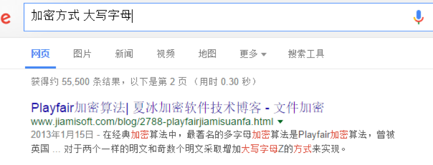

密文一眼看上去全是大写字母，略微数了一下发现少J，看来应该是用了什么奇怪的加密方式，GOOGLE一番，可以找到一个比较古典的加密方式，playfair

个人觉得这加密方法还挺复杂的，抓耳挠腮之后还是继续GOOGLE看看有没有现成的playfair破解工具。结果在stackoverflow或者什么Stackexchange之类的网站上找到了一个好像是个大学课程里面提供的C语言程序，http://www.cs.miami.edu/home/burt/learning/Csc609.051/programs/playn/，运行之后就解出了明文，但是明文还是有很多不准确的字母，稍微人肉看了几句话，再搜发现是I have a dream的内容，稍微比对比对，发现文末就是FLAG。
