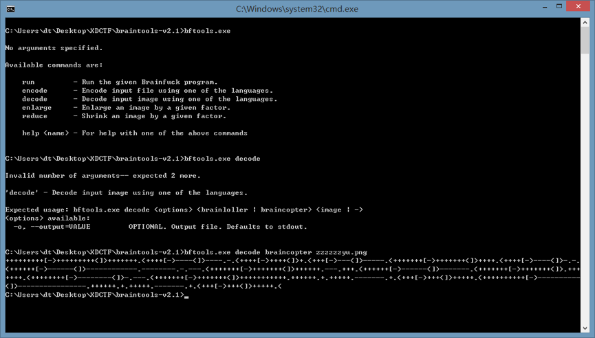
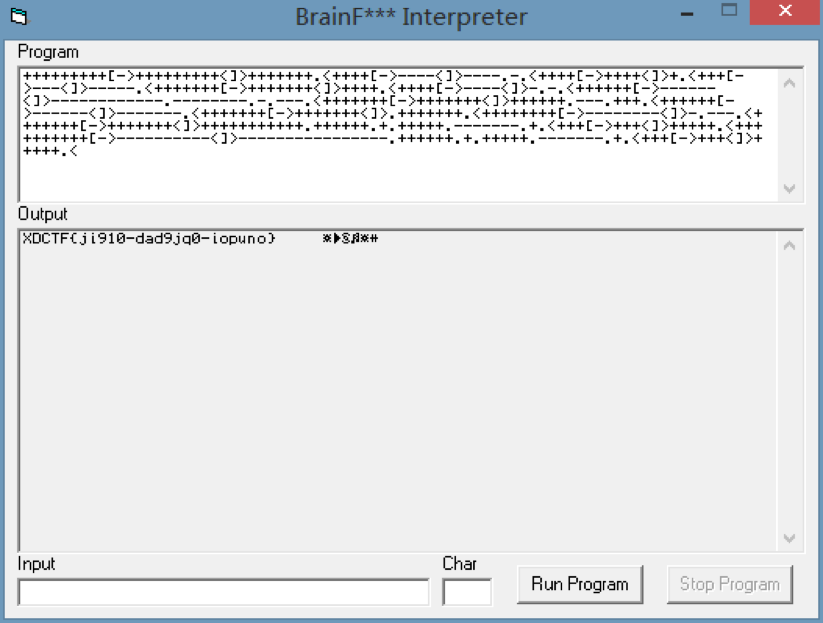

给出了一张官网logo一模一样的图片，一开始完全摸不着头脑。后来给出了原图，但是俩文件大小差了不少，应该不是简单的修改。然后给出了brain的提示，其实想到了跟brainfuck有关，但是我对brainfuck的理解也就是一个比较奇怪的编程语言，没有深入搜索。再然后说braintools了，我估摸着也是用了什么现成的图片隐写工具，直接GOOGLE或者github搜，找到braintool然后用命令解出来即可。

如此得到了brainfuck代码，然后用BFI工具跑一下就可以得到结果。

