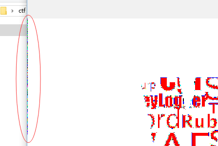

上来肯定先例行检查下LSB啦    

```python
>>> import Image
>>> a=Image.open('zxczxc.png')
>>> a.point(lambda i: 255 if i&1 else 0).show()
```



可以发现第一列有藏着东西，仔细看看像素值    

```python
>>> for i in xrange(100):
...     print a.getpixel((0,i))
...
(252, 255, 254)
(253, 252, 255)
(254, 252, 252)
(254, 253, 254)
(252, 255, 253)
(252, 253, 254)
(253, 254, 252)
(254, 252, 255)
(253, 255, 253)
(252, 253, 254)
(254, 253, 252)
(254, 253, 253)
(253, 254, 253)
(252, 253, 254)
(252, 255, 252)
...
```

发现其在252~255之间，那就是用了最后两位藏数据    
最后试了下是按像素顺序、RGB顺序、倒数第二第一位的顺序排列的01串    

```python
>>> s=''
>>> for i in xrange(165):
...     p=a.getpixel((0,i))
...     for k in xrange(3):
...             s+='1' if p[k]&2 else '0'
...             s+='1' if p[k]&1 else '0'
...
>>> s
'001110010011100000100110001101000110011000100011011101000110100100100101011001000110001100110010001100010011000000101110001100100011011100101110001100010011000000101110001100010011100100110101001011010011001000110000001100010011010100101101001100000011100100101101001100010011011001010100001100000011010100111010001100100011000100111010001101010011001000101011001100000011001000111010001100000011000000111001001110000010011000110100011001100010001101110100011010010010010101100100011000110111100011011010101010110100100001001001001011100100100110101011001011100010111000110001010011100100111111001100001100110100100000101111001100100010100111001000101010001101010001001101110011010100101100110110010010000011000111010110001101010011011110101110001010001101000100110101110011000010101111001001110101110011010111001100001101010100100101001111101011010000010100000000010110100111000000001111000101110011100100111000001001100011010001100110001000110111010001101001001001010110010001100011111111'
>>> def tostr(s):
...     ret=''
...     for i in xrange(0, len(s), 8):
...             ret+=chr(int(s[i:i+8],2))
...     return ret
...
>>> tostr(s)
'98&4f#ti%dc210.27.10.195-2015-09-16T05:21:52+02:0098&4f#ti%dcx\xda\xabHI.I\xab..1NO\xcc3H/2)\xc8\xa8\xd4M\xcdK6H1\xd657\xae(\xd15\xcc+\xc9\xd75\xcc5IO\xad\x05\x00Zp\x0f\x1798&4f#ti%dc?'
>>>
```

可以看到210.27.10.195-2015-09-16T05:21:52+02:00以及分隔符样的东西98&4f#ti%dc     
一开始还以为那个IP 210.27.10.195有什么东西...     
然后队友说这是zlib compressed才注意到第二个分隔符后有x\xda这个头.....     

```python
>>> import zlib
>>> zlib.decompress('x\xda\xabHI.I\xab..1NO\xcc3H/2)\xc8\xa8\xd4M\xcdK6H1\xd657\xae(\xd15\xcc+\xc9\xd75\xcc5IO\xad\x05\x00Zp\x0f\x1798&4f#ti%dc')
'xdctf{st3gan0gr4phy-enc0d3-73xt-1nto-1m4ge}'
```

得到Flag
