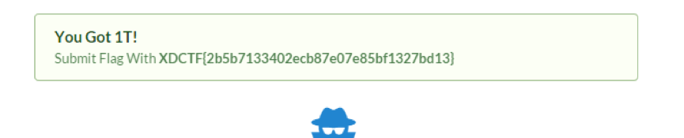

这道题看源代码就可以知道examples这个目录，但是后来就完全不知道怎么搞了。到了第二天晚上有个同学扫到了改Session的路径，也就是这个http://flagbox-23031374.xdctf.win:1234/examples/servlets/servlet/SessionExample ……
然后就很简单了，把user设成Administrator，pwd随便写，然后登录页面返回了not login的消息，猜猜，添个login=true的数据，就得到了flag。

