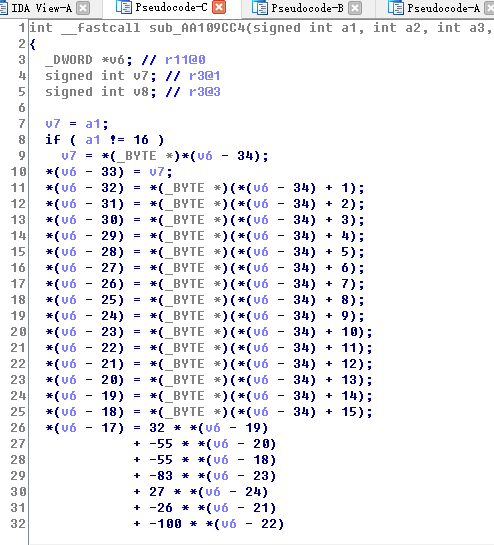
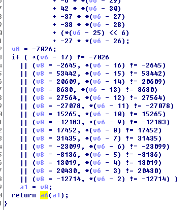
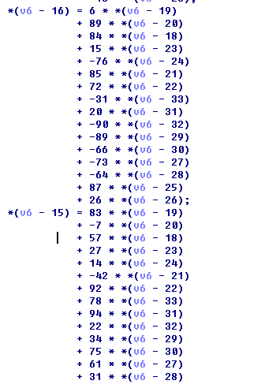

# opm 3pts
stegsolve按行提取rgb LSB得到zip，解压发现是一个arm的二进制代码段dump，转成二进制形式扔ida里，在0xaa109cc4处create function，F5得到这样的东西：


猜测v6-34是flag字符串，长为16。

然后函数结尾处有个check，


每个被检查的变量都是flag字符串的线性组合，如图：


那么提取系数，解16元线性方程组，得到flag:
```python
>>> import numpy
>>> a=numpy.array([[-32, 97, 46, 45, 67, 79, -73, -13, -5, 27, -83, -100, -26, -55, 32, -55], [-31, -90, 20, -66, -89, -64, -73, 26, 87, -76, 15, 72, 85, 89, 6, 84], [78, 22, 94, 75, 34, 31, 61, -16, 100, 14, 27, 92, -42, -7, 83, 57], [43, 44, 75, -59, -17, 82, -1, -44, 47, -68, 76, 72, 48, -89, 96, -27], [44, -60, 87, -64, 57, -18, -60, 9, -81, -33, 24, 84, 62, 89, 42, -97], [30, 68, 23, 91, 46, 32, -62, 42, -5, 54, -57, 59, 48, -97, 89, 79], [-29, -14, 14, -89, -60, 11, 49, -79, 75, -86, -99, -57, -10, 9, 62, -97], [58, 58, 17, 91, -98, -75, -5, -60, -26, 83, -81, 80, 97, 6, 31, -69], [-21, -11, 62, -77, 84, -86, 49, -66, -1, 26, -4, -27, -43, -1, 19, 73], [83, 43, 77, 96, 83, -20, 26, -7, -89, -60, -23, 68, -51, -75, 42, 35], [74, 58, 73, -86, -100, 71, 12, 66, 69, 50, 48, 58, -52, 14, 45, -91], [-60, -61, 26, -31, 20, -59, -53, 72, 68, -90, -41, -74, 48, -27, 30, 8], [-26, 19, 31, -16, -95, 33, 64, -83, 10, 98, -35, -76, 7, -12, 25, -34], [-89, 61, -40, -67, 20, 42, 27, -37, 38, -16, 71, 16, 75, 4, 51, -6], [32, 57, -92, -47, 40, -54, -21, -25, -14, 91, 64, 39, 7, 38, 96, 82], [-56, -6, 55, 42, -6, -38, -37, -27, 64, 16, -54, -53, -96, -31, 84, 100]])
>>> y=numpy.array([-7026,-2645,53442,20609,8630,27564,-27078,15265,-12183,17452,31435,-23099,-8136,13019,20430,-12714])
>>> import numpy.linalg
>>> x=numpy.linalg.solve(a,y)
>>> x
array([  84.,  114.,   52.,   99.,   49.,   78.,  103.,   95.,   70.,
         48.,   82.,   95.,   70.,  117.,   78.,   33.])
>>> ''.join([chr(int(round(i))) for i in x])
'Tr4c1Ng_F0R_FuN!'
```
