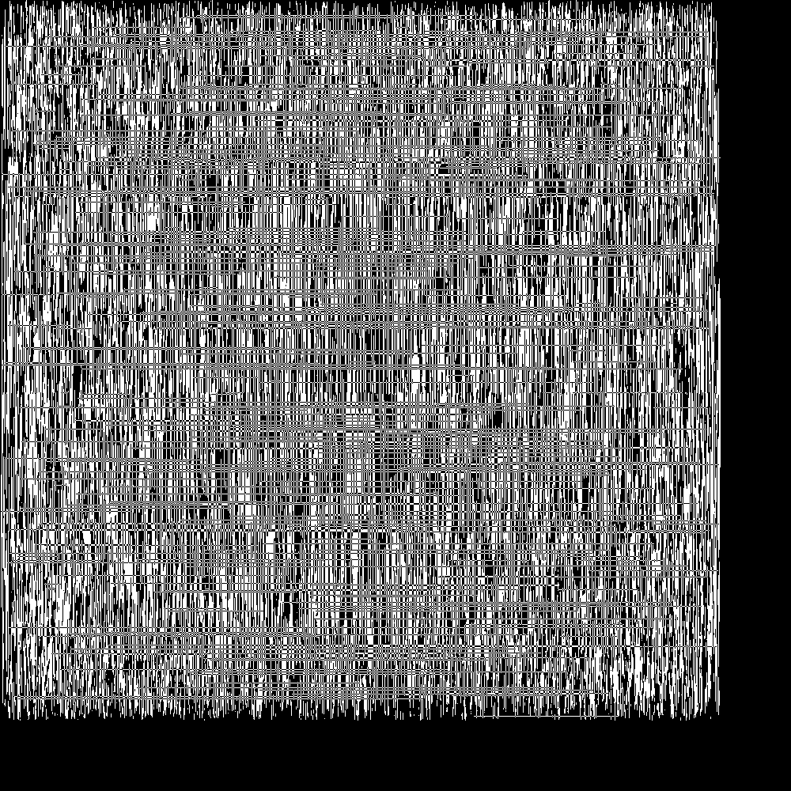
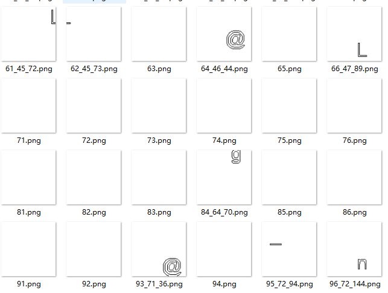
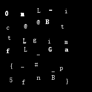

# xor painter 4pts
下下来一个一堆坐标的文件，一开始以为是每行是一条直线两个端点的坐标(x1, y1, x2, y2)，画出来然后直线的交叉点异或处理。后来画出来一个三角形区域，就知道了是(x1, x2, y1, y2)。在画出来一个正方形区域里一坨雪花，仔细想想后发现应该是每行表示一个矩形而不是直线，然后问题就变成了顶点上矩形覆盖数的奇偶性问题，用二维线段树去弄，复杂度才可以接受，就是poj2155原题。懒得写二维线段树就上网随便抄了段题解代码跑（oi的代码果然还是不可靠各种崩，换了n种版本终于不崩了），找了个大内存机器后强行开几G数组跑线段树，发现画出来一个似是而非的东西，中间一坨1像素的直线干扰，如下：



后来在开了脑洞，估计就是右下角坐标需要-1，也就是这矩形区域是左闭右开的，然后就画出对的图了，就是一张18000*18000的图里面有大概几个像素大小的字母散落在大图的各处....还需要后续处理一下...

二维线段树的c++代码，算法部分直接抄自网上某角落的题解：
```cpp

#define SIZE (18000)
#define maxn (72010)
#define DIR "./"

#define LINE_NUM (13663881)
#include <iostream>
#include <stdio.h>
#include <string.h>

using namespace std;
bool *tree[maxn];
int n;
bool sum;

/*
更新子线段树，tl、tr对应子矩阵的y1、y2，即要更新的范围。
rtx：母线段树(x轴)的节点，表示该子线段树属于母线段树的节点rtx
rt：子线段树的节点序号
L,R为子线段树节点rt的两端点
*/
void updatey(int rtx, int rt, int tl, int tr, int L, int R) {
	//一开始弄反了，写成L<=tl && tr<=R。。。
	//要注意，应该是所在节点rt的区间在所要更新的节点范围里，更新节点rt的区间对应的值
	if (tl <= L && R <= tr) {
		tree[rtx][rt] = !tree[rtx][rt];  //对属于更新范围里的子矩阵进行取反
		return;
	}
	int mid = (L + R) >> 1;
	//下面部分也可以换成注释掉的语句
	if (tl <= mid)
		updatey(rtx, rt << 1, tl, tr, L, mid);
	if (tr>mid)
		updatey(rtx, rt << 1 | 1, tl, tr, mid + 1, R);
	/*
	if(tr<=mid)
	updatey(rtx,rt<<1,tl,tr,L,mid);
	else if(tl>mid)
	updatey(rtx,rt<<1|1,tl,tr,mid+1,R);
	else{
	updatey(rtx,rt<<1,tl,mid,L,mid);
	updatey(rtx,rt<<1|1,mid+1,tr,mid+1,R);
	}
	*/


}
/*
更新左上角(x1,y1)，右下角(xr,yr)的子矩阵区域
更新时，先在x轴找到对应[xl,xr]区间的点，再找按y轴找到对应[yl,yr]区间的节点
rt:母线段树的节点序号
L,R:rt节点的区间端点
*/
void updatex(int rt, int xl, int xr, int yl, int yr, int L, int R) {
	//一开始弄反了，写成L<=xl && xr<=R。。。
	if (xl <= L && R <= xr) {
		updatey(rt, 1, yl, yr, 0, n);
		return;
	}
	int mid = (L + R) >> 1;
	//下面部分也可以换成注释掉的语句
	if (xl <= mid)
		updatex(rt << 1, xl, xr, yl, yr, L, mid);
	if (xr>mid)
		updatex(rt << 1 | 1, xl, xr, yl, yr, mid + 1, R);
	/*
	if(xr<=mid)
	updatex(rt<<1,xl,xr,yl,yr,L,mid);
	else if(xl>mid)
	updatex(rt<<1|1,xl,xr,yl,yr,mid+1,R);
	else{
	updatex(rt<<1,xl,mid,yl,yr,L,mid);
	updatex(rt<<1|1,mid+1,xr,yl,yr,mid+1,R);
	}
	*/

}
/*
这里注意的是，是直到L!=R的时候，才停止查询，否则就要一直查询下去，直到查询到y所在的叶子节点
因为这里“异或”就相当于lazy标记，所以要获得最后的值，则必须遍历过y所在的所有子矩阵
rtx：母线段树(x轴)的节点，表示该子线段树属于母线段树的节点rtx
rt：子线段树的节点序号
L,R为子线段树节点rt的两端点
*/
void queryy(int rtx, int rt, int y, int L, int R) {
	sum ^= tree[rtx][rt];  //这里注意：要先异或！
	if (L != R) {
		int mid = (L + R) >> 1;
		if (y <= mid)
			queryy(rtx, rt << 1, y, L, mid);
		else
			queryy(rtx, rt << 1 | 1, y, mid + 1, R);
	}
}
/*
这里注意的是，是直到L!=R的时候，才停止查询，否则就要一直查询下去，直到查询到点x所在的叶子节点
因为这里“异或”就相当于lazy标记，所以要获得(x,y)最后的值，则必须遍历过(x,y)点所在的所有子矩阵
rt：母线段树的节点序号
L,R为子线段树节点rt的两端点
x,y为所要查找的点的值
*/
void queryx(int rt, int x, int y, int L, int R) {
	queryy(rt, 1, y, 0, n);
	//注意：当L<R的时候，还要继续往下查询，直到L=R=y。而不是到L<=Y<=R的时候就停止
	if (L != R) {
		int mid = (L + R) >> 1;
		if (x <= mid)
			queryx(rt << 1, x, y, L, mid);
		else
			queryx(rt << 1 | 1, x, y, mid + 1, R);
	}
}

int main() {
	
	for (int i = 0; i < maxn; i++) {
		tree[i] = new bool[maxn];
		memset(tree[i], 0, sizeof(bool[maxn]));
	}

	n = SIZE;

	FILE *f = fopen(DIR"xorlist", "r");
	int x1, y1, x2, y2;
	for (int i = 0; i < LINE_NUM; i++) {
		fscanf(f, "%d, %d, %d, %d", &x1, &x2, &y1, &y2);
		updatex(1, x1, x2-1, y1, y2-1, 0, n);
		if (i % 500000 == 0) 
			printf("%d\n", i);
	}
	fclose(f);

	f = fopen(DIR"xor.output", "w");
	for (int i = 0; i < SIZE; i++) {
		for (int j = 0; j < SIZE; j++) {
			sum = false;
			queryx(1, x1, y1, 0, n);
			fprintf(f, "%c", sum ? '1' : '0');
		}
		if(i%10==0) printf("%d\n", i);
		fprintf(f, "\n");
	}
	fclose(f);
	
	return 0;
}
```


用PIL把输出画成大图：
```python
from PIL import Image
def draw():
    size = 18000
    a=open('./xor.output','rb').read()
    a=a.replace('\r','').split('\n')
    b=Image.new('L',(size,size))
    for i in xrange(size):
        if i%100==0: print i
        for j in xrange(size):
            b.putpixel((j, i), 255 if a[i][j]=='1' else 0)
    b.resize((1000,1000)).save('./xor3.bmp')
    b.save('./xor_original3.png')
```

找字母用代码，把图片和对应坐标打出来：
```python
import Image
img = Image.open('./xor_original3.png')
counter = 0
x=0
while x<180:
    print x
    y=0
    while y<180:
        flag = 0
        for i in xrange(100):
            for j in xrange(100):
                if img.getpixel((y*100+j, x*100+i)) == 0:
                    flag += 1
                    if flag > 10: break
            if flag > 10: break
        if flag > 10:
            counter += 1
            img.crop((y*100, x*100, (y+1)*100-1, (x+1)*100-1)).save('xor/%d_%d_%d.png' % (counter, x, y))
        y+=1
    counter += 1
    img.crop((0, 0, 99, 99)).save('xor/%d.png' % counter)
    x+=1
```

画出来这样的一堆图：


人肉识别一下：
```
10_9_19.png 0
115_89_35.png B
117_90_35.png B
121_93_73.png i
124_95_89.png G
126_96_6.png _
127_96_7.png _
128_96_89.png G
12_10_18.png 0
134_101_127.png _
135_101_144.png B
13_10_19.png 0
152_117_125.png p
155_119_44.png t
163_126_14.png i
164_126_74.png m
165_126_89.png a
167_127_89.png a
16_12_46.png c
170_129_152.png }
17_12_92.png f
19_13_92.png f
22_15_66.png t
26_18_122.png {
27_18_149.png 5
50_40_19.png m
51_40_20.png m
53_41_19.png m
54_41_20.png m
55_41_118.png _
58_43_153.png f
61_45_72.png L
62_45_73.png L
64_46_44.png @
66_47_89.png L
84_64_70.png g
89_68_119.png #
93_71_36.png @
95_72_94.png _
96_72_144.png n 
98_73_13.png L
```

重新渲染一张图...
```python
>>> zip(b,c)
[((9, 19), '0'), ((89, 35), 'B'), ((90, 35), 'B'), ((93, 73), 'i'), ((95, 89), 'G'), ((96, 6), '_'), ((96, 7), '_'), ((96, 89), 'G'), ((10, 18), '0'), ((101, 127), '_'), ((101, 144), 'B'), ((10, 19), '0'), ((117, 125), 'p'), ((119, 44), 't'), ((126, 14), 'i'), ((126, 74), 'm'), ((126, 89), 'a'), ((127, 89), 'a'), ((12, 46), 'c'), ((129, 152), '}'), ((12, 92), 'f'), ((13, 92), 'f'), ((15, 66), 't'), ((18, 122), '{'), ((18, 149), '5'), ((40, 19), 'm'), ((40, 20), 'm'), ((41, 19), 'm'), ((41, 20), 'm'), ((41, 118), '_'), ((43, 153), 'f'), ((45, 72), 'L'), ((45, 73), 'L'), ((46, 44), '@'), ((47, 89), 'L'), ((64, 70), 'g'), ((68, 119), '#'), ((71, 36), '@'), ((72, 94), '_'), ((72, 144), 'n'), ((73, 13), 'L')]
>>> a=Image.new('L',(180,180))
>>> dr=ImageDraw.Draw(a)
>>> for i,j in zip(b,c):
...     dr.text(i, unicode(j,'UTF-8'), font=font, fill=255)
...
>>> a.show()
>>> a.save('flag.png')
```

得到flag:

