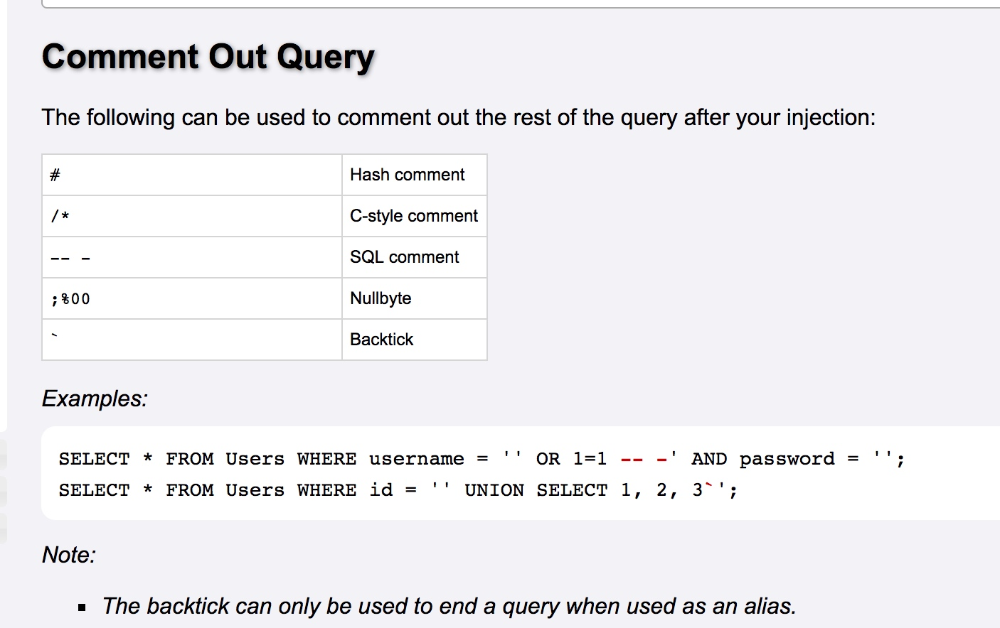

First, get source from <https://brave.dctf-quals-17.def.camp/index.php~>.

We can see that `$id` has been checked for lots of SQL keywords and `$key` has been escaped with `real_escape_string` quoted with `"`.

Of course, if we could escaped `$key` from quote, we can write various SQL statement. However, I failed to do so, even with gbk wide character.

Without escape `$key` from quote, the best choice to control the statement is to comment the left part with `$id`.
However, normal comment character (`#`, `--`, `/*`) is filtered.
With this [article](http://www.yulegeyu.com/2017/04/11/为什么-backtick-能做注释符/), we know there are another two way for commenting:

`Backtick` seems to be useless here, but `;%00` works well.
Unfortunately, from payload `https://brave.dctf-quals-17.def.camp/index.php?id=0;%00` and `https://brave.dctf-quals-17.def.camp/index.php?id=!0;%00` we know that the user id seems to be large that 1.
But all other digits are forbidden in `$id`.

To bypass the digits limit, we can use the hex format.
To express all the numbers by hex format with `a-f` only, we could substract two number.
So the final payload would be `https://brave.dctf-quals-17.def.camp/index.php?id=0xc-0xa;%00`.
