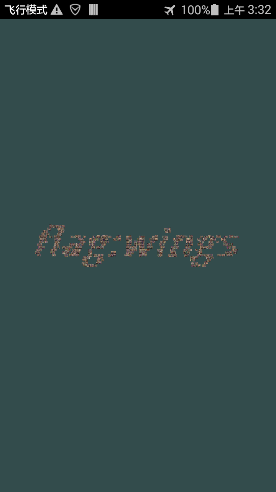

# 更新 @ Fri May  4 03:32:56 CST 2018

时隔 N 天，终于收到主办方反馈……
题目更新？WTF？中了诅咒么，去年也是决赛第一题安卓版出问题了……

新版下下来大概看了下，主要是把 texture 里面的图去掉了，em，果然之前做的是错的，不过确实当时卡住之后看着那张图和没有回复的邮箱就没有往下尝试的欲望了。

仔细看下会发现，之前说的 1019 个 model 被更新成了 1057 个 model，实际运行发现和之前人眼基本看不出啥区别，貌似没有别的区别了？
无疑，问题肯定是出在之前说过那一片奇怪的区域。
看来偷懒是不行了，于是把之前懒得做的操作做下，提取下这 1057 个 model 的坐标。
很明显可以看出坐标分成了两个部分，前 361 个是绘制那片奇怪区域的，剩下的是绘制箭头的。

对着坐标看了一会，没发现什么异常，于是仔细研究坐标含义。
首先坐标根据之前看程序的感觉，结合动态调试（拿着一个点控制变量法调节三维坐标的值）观察，可以发现，
这是一个球面坐标（不妨当做地球好了），三维分别是经度、纬度和到球面的距离（-90 大概是球心，故第三维限制为最小 -89）。

既然是球面坐标，继续对着坐标脑洞，考虑按 z 坐标分层，于是写了成脚本，按 z 坐标范围过滤，二维打点画图，试了半天后发现，貌似完全不分层的时候结果非常合理，咋看咋像 flag：

```
.................................................................................
......******.....................................................................
.....**...**.......................................**............................
....**....**.......................................**............................
....**...**......................................................................
..*****..**...******...*******..**..**...**...**..**...******....*******..******.
...**....**.......**..***.***..***..**..***..***..**..****.***..***.***..**......
..***...**........**..**..***.......**.****..**..**...**...***..**..***..**......
..**....**....*****...**..**........**.****.**...**...**...**...**..**...****....
..**....**..***..**...*****.........****.**.**...**..***...**...*****......***...
.***...**...**..***..**.............****.****...**...**...***..**...........**...
.**....**..***.***...**.......**....***..***....**...**...**...**..........***...
.**....**...******...******..***...***...***....**..***...**...******..******....
...................***...**..................................***...**............
...................**....**..................................**....**............
...................**...**...................................**...**.............
...................******....................................******..............
.................................................................................
```

瞬间感觉自己智障了，一直以为题目是要在不调试、不篡改程序的情况下，通过一些特定的移动方式，看到 flag，
其实，题目是想让我们换个视角来看地图，而程序本身大概是不能换到这个视角的。

虽然看到了 flag，但感觉这自己二维做图估计不会过，那考虑怎么在程序中转换视角。
继续调试，仔细观察下移动后更新的三维坐标和各个变换矩阵发现，我们的滑动约等于上下左右平移这个球，
view 矩阵是做了这个平移的操作，project 矩阵才是真正的视角矩阵，相当于放在球体外全局 z 轴上一固定地方相机，默认视角 45 度。

为了看到 flag，我们首先将全局记录的三维坐标改成 `(0, 0, -1)`，此时得到 view 矩阵：

```
1 0 0 0
0 1 0 0
0 0 1 -3
0 0 0 1
```

对于球面坐标而言，旋转比平移更容易，我们计算下箭头和 flag 坐标的平均值的差，
大致可以得出绕全局 y 轴旋转 -59°，绕全局 x 轴旋转 -17.5°，为了防止图案过大，我们可将球沿 z 轴负方向平移 -90，
于是最终得到 view 矩阵：

```
1 0 0 -59
0 1 0 -17.5
0 0 1 -90
0 0 0 1
```

修改好后，让程序完成绘制，可以看到 flag，见图。



题目很有意思，要说的话脑洞也不算大，就是刚开始直接给了图让人有点无语，总之，瑕不掩瑜！

PS: 手动转换 float 累哭了要！

# 旧版

解压发现这次竟然给的 txt，虽然文件名还是乱码，但至少都保证能正常打开了，给主办方点个赞。
根据上次的经验，决赛的题比较好玩，这次一看题目描述，就感觉有点意思了，比那无聊的预赛好玩多了……

然后 apktool 解包直接看到 res 里面有个 `flag.bmp`，写着 `flag:dogod`？
WTF？？？game over？？？

算了，假装什么都没看到，还是看下程序吧……

运行程序可以发现就是个简陋的游戏地图，按照箭头返现移动一下会发现移不动了，并且看起来后面有东西，那么看代码吧。

首先 Manifest 可以看出是个 NativeActivity，打开 so 看下会发现，跟 Android 官网样例基本一样……
对着样例标好函数后，大概看一下 `engine_handle_input` 很明显限制了 `x <= 50.0`，直接 patch 掉移过去发现是个奇奇怪怪的形状。
然后左看看，右看看，也没感觉有啥特别的，就一堆 OpenGL 的操作，但感觉应该没啥牵扯到 flag 的。

无奈之下，只得深入看下 OpenGL 代码细节了，然而不得不说，这 OpenGL 的代码真恶心，感觉就是给我源代码，也看不懂……
去年从零开始学 mono，今年从零开始学 OpenGL，感觉再这样比几次，能把游戏技术全学一遍了……

找个 OpenGL 教程对着看，结果发现，texture 竟然跟教程上一样，em，这个题真是样例代码大杂烩……
按照执行顺序来，整个程序流程：

1. 0x0002F420 是 init 函数，准备了顶点着色器和片段着色器的代码，然后初始化了一个 3057 个常量 float 的数组；

1. `android_main` 里面设置了 `engine_handle_cmd` 和 `engine_handle_input`，然后消息循环处理，无操作时直接调用 `draw (0x00030094)` 更新界面；

1. `engine_handle_input` 大致处理了一下滑动的操作，更新全局的当前坐标，同时会限制可移动的坐标范围；

1. `engine_handle_cmd` 大致处理了一下界面初始化的操作，加载了 `container.jpg` 和 `awesomeface.png` 作为着色器中的 texture，从 0xA18D8 加载了 180 个常量 float 做为顶点信息；

1. `draw` 中设定了 projection、view、model 三个变换矩阵并绘制界面，其中 view 由当前全局坐标算出，大致反应当前视角，model 由之前 3057 个 float 的常量数组决定，3 个一组，生成一个位移的矩阵（大致决定了绘制的全局坐标），同时结合上一个与分组 index 相关的旋转矩阵（达到类似随机旋转的效果），一共 1019 个 model。每个 model 会根据之前的 180 个顶点信息对应绘制 12 个三角形（每个顶点含有 3 维坐标及 2 维纹理坐标，`12 * 3 * 5 = 180`），应该是对应画了一个正方体的 6 个面。通过调试改变 model 个数，可以看出前一半画出了之前右上角的不规则图形，后一半画出了中间的箭头。

那么，很明显，中间的箭头并不是 `point.bmp` 当做纹理 load 进来叠加产生的，而是代码硬编码的常量，而 `flag.bmp` 则更是没有被 load 过，有理由怀疑右上角是想出 `flag.bmp` 的形状，然而不论怎么变形都看不出一丝相似度，gg。
整个程序看流程应该只有这点逻辑，不知道是不是还有什么隐藏逻辑没有发现，或者说和去年一样题又出错了？
主办方联系不上，脑洞也脑洞不出来，反正上来就有 `flag:dogod`，那就当是了……
